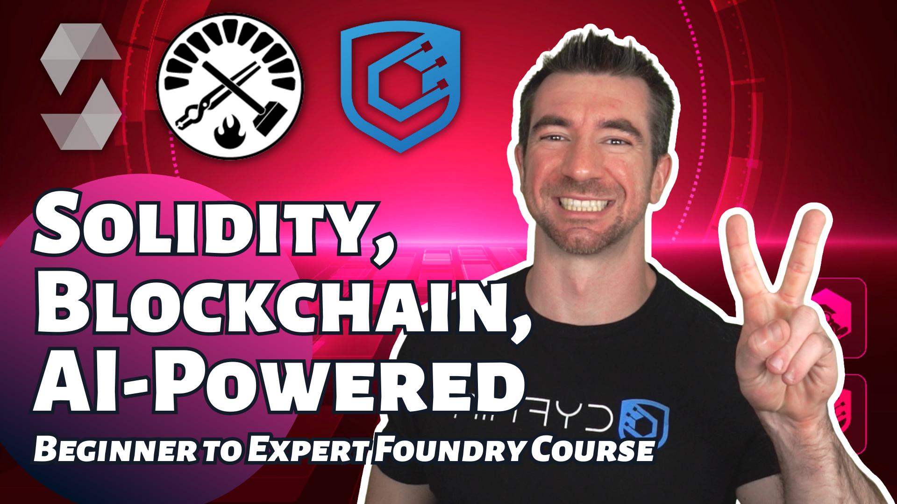
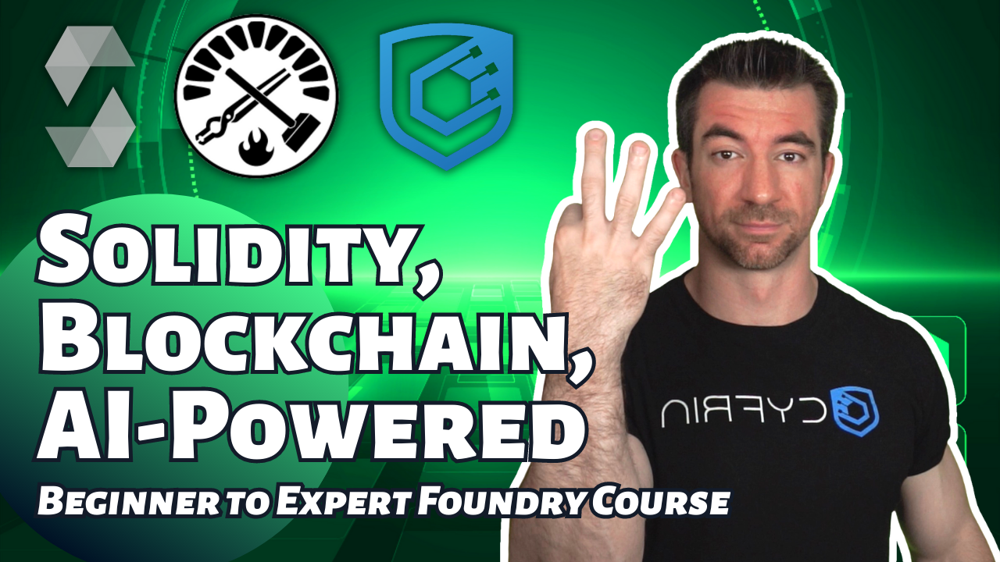

[contributors-shield]: https://img.shields.io/github/contributors/cyfrin/foundry-full-course-f23.svg?style=for-the-badge

[contributors-url]: https://github.com/cyfrin/foundry-full-course-f23/graphs/contributors

[forks-shield]: https://img.shields.io/github/forks/cyfrin/foundry-full-course-f23.svg?style=for-the-badge

[forks-url]: https://github.com/cyfrin/foundry-full-course-f23/network/members

[stars-shield]: https://img.shields.io/github/stars/cyfrin/foundry-full-course-f23.svg?style=for-the-badge

[stars-url]: https://github.com/cyfrin/foundry-full-course-f23/stargazers

[issues-shield]: https://img.shields.io/github/issues/cyfrin/foundry-full-course-f23.svg?style=for-the-badge

[issues-url]: https://github.com/cyfrin/foundry-full-course-f23/issues

[license-shield]: https://img.shields.io/github/license/cyfrin/foundry-full-course-f23.svg?style=for-the-badge

[license-url]: https://github.com/cyfrin/foundry-full-course-f23/blob/master/LICENSE.txt

[linkedin-shield]: https://img.shields.io/badge/-LinkedIn-black.svg?style=for-the-badge&logo=linkedin&colorB=555

<div align="center">
<h1> Blockchain Developer, Smart Contract, & Solidity Career Path - Powered By AI - Beginner to Expert Course <br>| Foundry Edition 2023  |</h1>


<p align="center"><strong>Learn smart contract development, and level up your career
</strong></p>


[![Stargazers][stars-shield]][stars-url] [![Forks][forks-shield]][forks-url]
[![Contributors][contributors-shield]][contributors-url]
[![Issues][issues-shield]][issues-url]
[![MIT License][license-shield]][license-url]
<p align="center">
    <br />
    <a href="https://cyfrin.io/">
        </a>
<a href="https://updraft.cyfrin.io/courses/foundry">
        </a>
    <br />
</p>


Welcome to the repository for the Blockchain Developer, Smart Contract, & Solidity Cyfrin Updraft - Career Path <br>| Powered By AI |<br>| Beginner to Expert Path |<br>| Foundry Edition 2023 |
</div>

This repository houses course resources and [discussions](https://github.com/Cyfrin/foundry-full-course-f23/discussions) for the course.

Please refer to this for an in-depth explanation of the content:

-   [Website](https://updraft.cyfrin.io) - Join Cyfrin Updraft and enjoy 50+ hours of smart contract development courses
-   [Twitter](https://twitter.com/CyfrinUpdraft) - Stay updated with the latest course releases
-   [LinkedIn](https://www.linkedin.com/school/cyfrin-updraft/) - Add Updraft to your learning experiences
-   [Discord](https://discord.gg/cyfrin) - Join a community of 3000+ developers and auditors
-   [Newsletter](https://cyfrin.io/newsletter) - Weekly security research tips and resources to level up your career
-   [Codehawks](https://codehawks.com) - Smart contracts auditing competitions to help secure web3
<!-- *Lol, my t-shirt is backwards in 2 of them* -->

<br/>
<table>
  <tr>
    <th align="center">Lessons 0 - 6</th>
    <th align="center">Lessons 7 - 11</th>
    <th align="center">Lessons 12 - 15</th>
  </tr>
  <tr>
    <td align="center">
      <a href="https://youtu.be/umepbfKp5rI" target="_blank">
        
      </a>
    </td>
    <td align="center">
      <a href="https://youtu.be/sas02qSFZ74" target="_blank">
        
      </a>
    </td>
    <td align="center">
      <a href="https://youtu.be/wUjYK5gwNZs" target="_blank">
        
      </a>
    </td>
  </tr>
</table>
<br/>

[YouTube Playlist](https://www.youtube.com/playlist?list=PL4Rj_WH6yLgWe7TxankiqkrkVKXIwOP42)

[YouTube Playlist of each section](https://www.youtube.com/playlist?list=PL2-Nvp2Kn0FPH2xU3IbKrrkae-VVXs1vk)

# Table of Contents

> All the lessons for on this repo are for several courses on the Solidity Developer Career path of Cyfrin Updraft.

<details>
<summary>Resources</summary>
<ol>
<li><a href="#blockchain-developer-smart-contract--solidity-course---powered-by-ai---beginner-to-expert-course--foundry-edition-2023">Blockchain Developer, Smart Contract, & Solidity Course - Powered By AI - Beginner to Expert Course | Foundry Edition 2023</a></li>
<li><a href="#table-of-contents">Table of Contents</a>
  <ul>
    <li><a href="#recommended-tools">Recommended Tools</a></li>
  </ul>
</li>
<li><a href="#testnet-faucets">Testnet Faucets</a></li>
<li><a href="#resources-for-this-course">Resources For This Course</a></li>
<li><a href="#bonus-nfts">Bonus NFTs</a>
  <ul>
    <li><a href="#important-notes-for-arbitrum">Important Notes for Arbitrum</a></li>
    <li><a href="#bridging-to-arbitrum">Bridging to Arbitrum</a></li>
  </ul>
</li>
</ol>
</details>
<details>
<summary> <a href="#lesson-0-welcome-to-the-course">Lesson 0: Welcome to the Course!</a></summary>
<ol>
  <li>
  <a href="#welcome-to-the-course">Welcome to the course! </a>
  </li>
  <li>
  <a href="#best-practices">Best Practices </a>
  </li>
</ol>
</details>
<details>
<summary>
<a href="#lesson-1-blockchain-basics">Lesson 1: Blockchain Basics</a>
</summary>
<ol>
    <li><a href="#what-is-a-blockchain-what-does-a-blockchain-do">What is a Blockchain? What does a blockchain do?</a></li>
    <li><a href="#the-purpose-of-smart-contracts">The Purpose Of Smart Contracts</a></li>
    <li><a href="#other-blockchain-benefits">Other Blockchain Benefits</a></li>
    <li><a href="#what-have-smart-contracts-done-so-far">What have Smart Contracts done so far?</a></li>
    <li><a href="#making-your-first-transaction">Making Your First Transaction</a></li>
    <li><a href="#gas-i-introduction-to-gas">Gas I: Introduction to Gas</a></li>
    <li><a href="#how-do-blockchains-work">How Do Blockchains Work?</a></li>
    <li><a href="#signing-transactions">Signing Transactions</a></li>
    <li><a href="#gas-ii">Gas II</a></li>
    <li><a href="#gas-ii-summary">Gas II Summary</a></li>
    <li><a href="#high-level-blockchain-fundamentals">High-Level Blockchain Fundamentals</a></li>
</ol>
</details>

<details>
<summary>
<a href="#lesson-2-welcome-to-remix---remix-simple-storage">Lesson 2: Welcome to Remix - Remix Simple Storage</a>
</summary>
<ol>
    <li><a href="#introduction">Introduction</a></li>
    <li><a href="#setting-up-your-first-contract">Setting Up Your First Contract</a></li>
    <li><a href="#basic-solidity-types">Basic Solidity: Types</a></li>
    <li><a href="#basic-solidity-functions">Basic Solidity: Functions</a></li>
    <li><a href="#basic-solidity-arrays--structs">Basic Solidity: Arrays &amp; Structs</a></li>
    <li><a href="#basic-solidity-compiler-errors-and-warnings">Basic Solidity: Compiler Errors and Warnings</a></li>
    <li><a href="#memory-storage-calldata-intro">Memory, Storage, Calldata (Intro)</a></li>
    <li><a href="#mappings">Mappings</a></li>
    <li><a href="#deploying-your-first-contract">Deploying your First Contract</a></li>
    <li><a href="#the-evm--a-recap-of-lesson-2">The EVM &amp; A Recap of Lesson 2</a></li>
</ol>
</details>
<details>
<summary><a href="#lesson-3-remix-storage-factory">Lesson 3: Remix Storage Factory</a></summary>
<ol>
    <li><a href="#introduction-1">Introduction</a></li>
    <li><a href="#basic-solidity-importing-contracts-into-other-contracts">Basic Solidity: Importing Contracts into other Contracts</a></li>
    <li><a href="#basic-solidity-interacting-with-other-contracts">Basic Solidity: Interacting with other Contracts</a></li>
    <li><a href="#basic-solidity-inheritance--overrides">Basic Solidity: Inheritance &amp; Overrides</a></li>
    <li><a href="#lesson-3-recap">Lesson 3 Recap</a></li>
  </ol>
</details>
<details>
<summary>
<a href="#lesson-4-remix-fund-me">Lesson 4: Remix Fund Me</a>
</summary>
  <ol>
    <li><a href="#introduction-2">Introduction</a></li>
    <li><a href="#setup">Setup</a></li>
    <li><a href="#sending-eth-through-a-function">Sending ETH through a function</a></li>
    <li><a href="#reverts">Reverts</a></li>
    <li><a href="#getting-real-world-price-data-chainlink">Getting real world price data (Chainlink)</a></li>
    <li><a href="#quick-recap-i">Quick recap I</a></li>
    <li><a href="#interfaces">Interfaces</a></li>
    <li><a href="#ai-help-iii">AI Help III</a></li>
    <li><a href="#importing-from-npm--github">Importing from NPM / GitHub</a></li>
    <li><a href="#getting-prices-from-chainlink">Getting Prices from Chainlink</a></li>
    <li><a href="#more-solidity-math">More solidity math</a></li>
    <li><a href="#msgsender">msg.sender</a></li>
    <li><a href="#quick-recap-ii">Quick recap II</a></li>
    <li><a href="#library">Library</a></li>
    <li><a href="#safemath">SafeMath</a></li>
    <li><a href="#for-loop">For Loop</a></li>
    <li><a href="#resetting-an-array">Resetting an array</a></li>
    <li><a href="#transfer-send-and-call">Transfer, Send, and Call</a></li>
    <li><a href="#constructor">Constructor</a></li>
    <li><a href="#modifiers">Modifiers</a></li>
    <li><a href="#testnet-demo">Testnet Demo</a></li>
    <li><a href="#advanced-solidity">Advanced Solidity</a>
      <ul>
        <li><a href="#immutable--constant">Immutable &amp; Constant</a></li>
        <li><a href="#custom-errors">Custom Errors</a></li>
        <li><a href="#receive--fallback-functions">Receive &amp; Fallback Functions</a></li>
      </ul>
    </li>
  </ol>
</details>

<details>
<summary><a href="#lesson-5-ai-prompting-asking-questions-and-getting-help">Lesson 5: AI Prompting, Asking Questions, and Getting Help</a></summary>
<ol>
    <li><a href="#intro">Intro</a></li>
    <li><a href="#7-tips-for-this-course">7 Tips for this Course</a></li>
    <li><a href="#setting-up-github">Setting up GitHub</a></li>
    <li><a href="#formatting-a-question">Formatting a question</a></li>
    <li><a href="#speedrunethereum">SpeedRunEthereum</a></li>
</ul>
</details>
<details>
<summary>
<a href="#lesson-6-foundry-simple-storage">Lesson 6: Foundry Simple Storage</a>
</summary>
  <ol>
    <li><a href="#introduction-3">Introduction</a></li>
    <li><a href="#installation--setup-macos--linux">Installation &amp; Setup (MacOS &amp; Linux)</a>
      <ul>
        <li><a href="#windows-setup">Windows Setup</a></li>
        <li><a href="#gitpod">Gitpod</a></li>
      </ul>
    </li>
    <li><a href="#local-development-introduction">Local Development Introduction</a></li>
    <li><a href="#foundry-install">Foundry Install</a></li>
    <li><a href="#vscode-setup-ii">VSCode Setup II</a></li>
    <li><a href="#foundry-setup">Foundry Setup</a></li>
    <li><a href="#formatting-solidity-in-vscode">Formatting Solidity in VSCode</a></li>
    <li><a href="#compiling-in-foundry">Compiling in Foundry</a></li>
    <li><a href="#deploying-to-a-local-chain-i-anvil-or-ganache">Deploying to a local chain I (Anvil or Ganache)</a></li>
    <li><a href="#adding-another-network-to-metamask">Adding another network to metamask</a></li>
    <li><a href="#deploying-to-a-local-chain-ii-forge-create">Deploying to a local chain II (Forge Create)</a></li>
    <li><a href="#private-key-rant-i">Private Key Rant I</a></li>
    <li><a href="#deploying-to-a-local-chain-iii-forge-script">Deploying to a local chain III (Forge Script)</a></li>
    <li><a href="#what-is-a-transaction-but-actually">What is a transaction (But actually)</a></li>
    <li><a href="#private-key-rant-ii">Private Key Rant II</a></li>
    <li><a href="#can-you-encrypt-a-private-key---a-keystore-in-foundry-yet">Can you Encrypt a Private Key -&gt; a keystore in foundry yet??</a></li>
    <li><a href="#thirdweb-deploy">ThirdWeb Deploy</a></li>
    <li><a href="#private-key-rant-summary">Private Key Rant Summary:</a></li>
    <li><a href="#cast-send">Cast Send</a></li>
    <li><a href="#deploying-to-a-testnet-or-a-mainnet">Deploying to a testnet or a mainnet</a></li>
    <li><a href="#verifying-a-contract-the-manual-way">Verifying a contract the manual way</a></li>
    <li><a href="#cleaning-up-the-project">Cleaning up the project</a></li>
    <li><a href="#alchemy">Alchemy</a></li>
    <li><a href="#summary">Summary</a></li>
  </ol>
</details>

<details>
<summary>
<a href="#lesson-7-foundry-fund-me">Lesson 7: Foundry Fund Me</a>
</summary>
<ol>
    <li><a href="#introduction-4">Introduction</a></li>
    <li><a href="#setup-1">Setup</a></li>
    <li><a href="#testing-introduction">Testing Introduction</a></li>
    <li><a href="#setup-continued">Setup Continued</a></li>
    <li><a href="#tests">Tests</a></li>
    <li><a href="#debugging-tests-i">Debugging Tests I</a></li>
    <li><a href="#advanced-deploy-scripts-i">Advanced Deploy Scripts I</a></li>
    <li><a href="#forked-tests">Forked Tests</a></li>
    <li><a href="#refactoring-i-testing-deploy-scripts">Refactoring I: Testing Deploy Scripts</a></li>
    <li><a href="#refactoring-ii-helper-config">Refactoring II: Helper Config</a></li>
    <li><a href="#refactoring-iii-mocking-continued">Refactoring III: Mocking (continued)</a></li>
    <li><a href="#magic-numbers">Magic Numbers</a></li>
    <li><a href="#break-time">Break time!</a>
    <li><a href="#more-cheatcodes">More Cheatcodes</a></li>
    <li><a href="#more-coverage">More Coverage</a></li>
    <li><a href="#chisel">Chisel</a></li>
    <li><a href="#gas-cheaper-withdraw">Gas: Cheaper Withdraw</a></li>
    <li><a href="#storage">Storage</a></li>
    <li><a href="#gas-cheaper-withdraw-continued">Gas: Cheaper Withdraw (continued)</a></li>
    <li><a href="#interactionsssol">Interactions.s.sol</a></li>
    <li><a href="#makefile">Makefile</a></li>
    <li><a href="#pushing-to-github">Pushing to GitHub</a></li>
    <li><a href="#-tweet-me-add-your-repo-in">🐸🐦 Tweet Me (add your repo in)!</a></li>
    <li><a href="#recap">Recap</a></li>
  </ol>
</details>
<details>
<summary>
<a href="#lesson-8-htmljs-fund-me-quick-fullstack--front-end-tutorial">Lesson 8: Html/Js Fund Me (Quick Fullstack / Front End Tutorial)</a>
</summary>
  <ol>
    <li><a href="#introduction-5">Introduction</a></li>
    <li><a href="#setup-2">Setup</a></li>
    <li><a href="#how-metamask-works-with-your-browser">How metamask works with your browser</a></li>
    <li><a href="#introduction-to-function-selectors">Introduction to function selectors</a></li>
    <li><a href="#recap-1">Recap</a></li>
  </ol>
</details>
<details>
<summary>
<a href="#lesson-9-foundry-smart-contract-lottery">Lesson 9: Foundry Smart Contract Lottery</a>
</summary>
<ol>
    <li><a href="#introduction-6">Introduction</a></li>
    <li><a href="#rafflesol-setup">Raffle.sol Setup</a></li>
    <li><a href="#solidity-contract-layout">Solidity Contract Layout</a></li>
    <li><a href="#custom-errors-1">Custom Errors</a></li>
    <li><a href="#events">Events</a></li>
    <li><a href="#blocktimestamp">block.timestamp</a></li>
    <li><a href="#chainlink-vrf">Chainlink VRF</a>
      <ul>
        <li><a href="#sub-lesson-chainlink-vrf">Sub-Lesson: Chainlink VRF</a></li>
      </ul>
    </li>
    <li><a href="#implementing-chainlink-vrf---introduction">Implementing Chainlink VRF - Introduction</a></li>
    <li><a href="#implementing-chainlink-vrf---the-request">Implementing Chainlink VRF - The Request</a></li>
    <li><a href="#implementing-chainlink-vrf---the-fulfill">Implementing Chainlink VRF - The FulFill</a></li>
    <li><a href="#chainlink-vrf-recap">Chainlink VRF Recap</a>
      <ul>
        <li><a href="#modulo">Modulo</a></li>
      </ul>
    </li>
    <li><a href="#enum">Enum</a></li>
    <li><a href="#resetting-an-array-1">Resetting an array</a></li>
    <li><a href="#note-on-building">Note on building</a></li>
    <li><a href="#cei">CEI</a></li>
    <li><a href="#introduction-to-chainlink-automation">Introduction to Chainlink Automation</a></li>
    <li><a href="#implementing-chainlink-keepers---checkupkeep">Implementing Chainlink Keepers - checkUpkeep</a>
      <ul>
        <li><a href="#enums">Enums</a></li>
      </ul>
    </li>
    <li><a href="#implementing-chainlink-keepers---checkupkeep-continued">Implementing Chainlink Keepers - checkUpkeep continued</a></li>
    <li><a href="#implementing-chainlink-keepers---performupkeep">Implementing Chainlink Keepers - performUpkeep</a></li>
    <li><a href="#mid-lesson-recap">Mid-Lesson Recap</a></li>
    <li><a href="#tests--deploy-script-setup">Tests & Deploy Script Setup</a>
      <ul>
        <li><a href="#mock-chainlink-vrf-coordinator">Mock Chainlink VRF Coordinator</a></li>
      </ul>
    </li>
    <li><a href="#tests--deploy-script-continued">Tests & Deploy Script Continued</a></li>
    <li><a href="#lots-of-tests">Lots of Tests</a>
      <ul>
        <li><a href="#testing-events-in-foundry">Testing Events in Foundry</a></li>
        <li><a href="#vmroll--vmwarp">vm.roll & vm.warp</a></li>
      </ul>
    </li>
    <li><a href="#create-subscription-script">Create Subscription Script</a></li>
    <li><a href="#create-subscription-from-the-ui">Create Subscription from the UI</a></li>
    <li><a href="#fund-subscription-script">Fund Subscription Script</a></li>
    <li><a href="#add-consumer-script">Add Consumer Script</a></li>
    <li><a href="#more-tests">More Tests</a></li>
    <li><a href="#performupkeep-tests">PerformUpkeep Tests</a></li>
    <li><a href="#getting-event-data-into-foundry-scripts">Getting Event Data into Foundry Scripts</a></li>
    <li><a href="#intro-to-fuzz-tests">Intro to Fuzz tests</a></li>
    <li><a href="#one-big-test">One Big Test</a></li>
    <li><a href="#passing-the-private-key-to-vmstartbroadcast">Passing the private key to vm.startBroadcast</a></li>
    <li><a href="#integrations-test">Integrations Test</a></li>
    <li><a href="#testnet-demo---makefile-setup">Testnet Demo - Makefile setup</a></li>
    <li><a href="#testnet-demo---the-demo">Testnet Demo - The Demo</a></li>
    <li><a href="#consolelog-debugging">Console.log Debugging</a></li>
    <li><a href="#forge-test---debug">forge test --debug</a></li>
    <li><a href="#recap-2">Recap</a>
      <ul>
        <li><a href="#recommended-link-amounts-for-sepolia-staging-test">Recommended LINK amounts for Sepolia Staging Test:</a></li>
      </ul>
    </li>
</ol>
</details>

<details>
<summary>
<a href="#lesson-10-foundry-erc20s">Lesson 10: Foundry ERC20s</a>
</summary>
<ol>
    <li><a href="#what-is-an-erc-what-is-an-eip">What is an ERC? What is an EIP?</a></li>
    <li><a href="#what-is-an-erc20">What is an ERC20?</a></li>
    <li><a href="#manually-creating-an-erc20-token">Manually Creating an ERC20 Token</a></li>
    <li><a href="#erc20-token---openzeppelin">ERC20 Token - Openzeppelin</a></li>
    <li><a href="#deploy-script">Deploy Script</a></li>
    <li><a href="#ai-tests">AI Tests</a></li>
    <li><a href="#lesson-10-recap">Lesson 10 Recap</a></li>
</ol>
</details>
<details>
<summary>
<a href="#lesson-11-foundry-nfts--moodnft">Lesson 11: Foundry NFTs | MoodNFT</a>
</summary>
  <ol>
    <li><a href="#introduction-7">Introduction</a></li>
    <li><a href="#what-is-an-nft">What is an NFT?</a></li>
    <li><a href="#foundry-setup-1">Foundry Setup</a></li>
    <li><a href="#ipfs">IPFS</a></li>
    <li><a href="#using-ipfs">Using IPFS</a></li>
    <li><a href="#basic-nft-deploy-script">Basic NFT: Deploy Script</a></li>
    <li><a href="#basic-nft-tests">Basic NFT: Tests</a></li>
    <li><a href="#basic-nft-interactions">Basic NFT: Interactions</a></li>
    <li><a href="#basic-nft-testnet-demo">Basic NFT: Testnet Demo</a></li>
    <li><a href="#the-issue-with-ipfs--https-tokenuri-nfts">The issue with IPFS & HTTPS TokenURI NFTs</a></li>
    <li><a href="#what-is-an-svg">What is an SVG?</a></li>
    <li><a href="#svg-nft-introduction">SVG NFT: Introduction</a></li>
    <li><a href="#svg-nft-encoding-the-nft">SVG NFT: Encoding the NFT</a></li>
    <li><a href="#svg-nft-flipping-the-mood">SVG NFT: Flipping the mood</a></li>
    <li><a href="#svg-nft-deploy-script">SVG NFT: Deploy Script</a></li>
    <li><a href="#svg-nft-debugging-practice--some-notes">SVG NFT: Debugging practice & some notes</a></li>
    <li><a href="#svg-nft-anvil-demo">SVG NFT: Anvil Demo</a></li>
    <li><a href="#advanced-evm-opcodes-encoding-and-calling">Advanced: EVM Opcodes, Encoding, and Calling</a>
      <ul>
        <li><a href="#abiencode--abiencodepacked">abi.encode & abi.encodePacked</a></li>
        <li><a href="#introduction-to-encoding-function-calls-directly">Introduction to Encoding Function Calls Directly</a></li>
        <li><a href="#introduction-to-encoding-function-calls-recap">Introduction to Encoding Function Calls Recap</a></li>
        <li><a href="#encoding-function-calls-directly">Encoding Function Calls Directly</a></li>
      </ul>
    </li>
    <li><a href="#verifying-metamask-transactions">Verifying Metamask Transactions</a></li>
    <li><a href="#filecoin--arweave">Filecoin & Arweave</a></li>
    <li><a href="#lesson-11-recap">Lesson 11 Recap</a></li>
</ol>
</details>

<details>
<summary>
<a href="#lesson-12-foundry-defi--stablecoin-the-pinnacle-project-get-here">Lesson 12: Foundry DeFi | Stablecoin (The PINNACLE PROJECT!! GET HERE!)</a>
</summary>
<ol>
    <li><a href="#what-is-defi">What is DeFi?</a></li>
    <li><a href="#code-walkthrough">Code Walkthrough</a></li>
    <li><a href="#what-is-a-stablecoin-but-actually">What is a stablecoin (But actually)</a></li>
    <li><a href="#decentralizedstablecoinsol">DecentralizedStableCoin.sol</a></li>
    <li><a href="#dscenginesol-setup">DSCEngine.sol Setup</a></li>
    <li><a href="#deposit-collateral">Deposit Collateral</a></li>
    <li><a href="#mint-dsc">Mint DSC</a>
      <ul>
        <li><a href="#getting-the-value-of-our-collateral">Getting the value of our collateral</a></li>
        <li><a href="#health-factor">Health Factor</a></li>
        <li><a href="#minting-the-dsc">Minting the DSC</a></li>
      </ul>
    </li>
    <li><a href="#testing-while-developing">Testing while developing</a>
      <ul>
        <li><a href="#deploy-script-1">Deploy Script</a></li>
        <li><a href="#tests-1">Tests</a></li>
      </ul>
    </li>
    <li><a href="#depositcollateralandmintdsc">depositCollateralAndMintDsc</a></li>
    <li><a href="#redeemcollateral">redeemCollateral</a></li>
    <li><a href="#liquidate">Liquidate</a>
      <ul>
        <li><a href="#setup-3">Setup</a></li>
        <li><a href="#refactoring">Refactoring</a></li>
      </ul>
    </li>
    <li><a href="#leveling-up-your-testing-skillz">Leveling up your testing skillz</a></li>
    <li><a href="#challenge-code-coverage-above-80-for-dscenginesol">Challenge: Code coverage above 80% for DSCEngine.sol</a></li>
    <li><a href="#fuzz-invariant-testing">Fuzz (Invariant) Testing</a></li>
    <li><a href="#open-based-fuzz-tests">Open-based Fuzz tests</a></li>
    <li><a href="#handler-based-fuzz-tests">Handler-based Fuzz tests</a>
      <ul>
        <li><a href="#revert_on_fail--true">revert_on_fail = true</a></li>
        <li><a href="#redeeming-collateral">Redeeming Collateral</a></li>
        <li><a href="#minting-dsc">Minting DSC</a></li>
        <li><a href="#debuggin-fuzz-tests">Debuggin Fuzz Tests</a></li>
        <li><a href="#challenge-find-out-why-mintdsc-is-never-being-called-on-our-handlersol">Challenge: Find out why `mintDsc` is never being called on our Handler.sol</a></li>
      </ul>
    </li>
    <li><a href="#price-feed-handling">Price Feed Handling</a></li>
    <li><a href="#oraclelib">OracleLib</a></li>
    <li><a href="#note-on-audit-preparedness">Note on audit preparedness</a></li>
    <li><a href="#recap-3">Recap</a></li>
    <li><a href="#lens-protocol">Lens Protocol</a></li>
      <ul>
        <li><a href="#more-defi-learnings">More DeFi Learnings:</a></li>
      </ul>
</ol>
</details>

<details>
<summary>
<a href="#lesson-13-foundry-upgrades">Lesson 13: Foundry Upgrades</a>
</summary>
<ol>
    <li><a href="#upgradable-smart-contracts-overview">Upgradable Smart Contracts Overview</a></li>
    <li><a href="#types-of-upgrades">Types of Upgrades</a></li>
    <li><a href="#delegatecall">Delegatecall</a></li>
    <li><a href="#small-proxy-example">Small Proxy Example</a></li>
    <li><a href="#universal-upgradable-smart-contract">Universal Upgradable Smart Contract</a>
      <ul>
        <li><a href="#setup-4">Setup</a></li>
        <li><a href="#initializer">Initializer</a></li>
        <li><a href="#deploy">Deploy</a></li>
        <li><a href="#upgradebox">UpgradeBox</a></li>
        <li><a href="#test--demo">Test / Demo</a></li>
      </ul>
    </li>
    <li><a href="#testnet-demo-1">Testnet Demo</a></li>
</ol>
</details>
<details>
<summary>
<a href="#lesson-14-foundry-dao--governance">Lesson 14: Foundry DAO / Governance</a>
</summary>
  <ol>
    <li><a href="#introduction-8">Introduction</a></li>
    <li><a href="#what-is-a-dao">What is a DAO?</a></li>
    <li><a href="#how-to-build-a-dao">How to build a DAO</a>
      <ul>
        <li><a href="#setup-5">Setup</a></li>
        <li><a href="#governance-token">Governance Token</a></li>
        <li><a href="#governor">Governor</a></li>
        <li><a href="#tests-2">Tests</a></li>
      </ul>
    </li>
    <li><a href="#wrap-up">Wrap up</a></li>
    <li><a href="#bonus-gas-optimization-tips">Bonus: Gas optimization tips</a></li>
  </ol>
</details>
<details>
<summary>
<a href="#lesson-15-smart-contract-security--auditing-for-developers">Lesson 15: Smart Contract Security & Auditing (For developers)</a>
</summary>
  <ol>
    <li><a href="#introduction-9">Introduction</a></li>
    <li><a href="#what-is-a-smart-contract-audit">What is a smart contract audit?</a></li>
    <li><a href="#tools">Tools</a>
      <ul>
        <li><a href="#manual-review">Manual Review</a></li>
        <li><a href="#static-analysis">Static Analysis</a></li>
        <li><a href="#dynamic-analysis">Dynamic Analysis</a></li>
        <li><a href="#formal-verification">Formal Verification</a></li>
        <li><a href="#symbolic-execution">Symbolic Execution</a></li>
        <li><a href="#fuzzing">Fuzzing</a></li>
        <li><a href="#formal-verification--symbolic-execution">Formal Verification (& Symbolic Execution)</a></li>
        <li><a href="#other-security-stuff">Other security stuff</a></li>
      </ul>
    </li>
    <li><a href="#what-does-the-process-of-manual-review-look-like">What does the process of manual review look like?</a></li>
    <li><a href="#formal-verification">Formal Verification</a></li>
    <li><a href="#closing-thoughts">Closing Thoughts</a></li>
  </ol>
</details>

<details>
<summary>
<a href="#congratulations">Congratulations</a>
</summary>
<ol>
    <li><a href="#where-do-i-go-now">Where do I go now?</a>
      <ul>
        <li><a href="#learning-more">Learning More</a></li>
        <li><a href="#community">Community</a></li>
        <li><a href="#hackathons">Hackathons</a></li>
      </ul>
</ol>
</details>

<a href="#disclosures">Disclosures</a>

<a href="#thank-you">Thank you</a>

## Recommended Tools

- Recommended Testnet: Sepolia
- Recommended DevOps: [foundry-devops](https://github.com/Cyfrin/foundry-devops)

# [Testnet Faucets](https://faucets.chain.link)

- Main Faucet:<a href="https://sepoliafaucet.com/" target="_blank"> https://sepoliafaucet.com/</a>
- Backup Faucet:<a href="https://www.infura.io/faucet/sepolia" target="_blank" > https://www.infura.io/faucet/sepolia</a>

> ⚠️ All code associated with this course is for demo purposes only. They have not been audited and should not be considered production ready. Please use at your own risk.

# Resources For This Course

- AI Frens
  - [ChatGPT](https://chat.openai.com/)
    - Just know that it will often get things wrong, but it's very fast!
  - [Phind](https://www.phind.com/)
    - Like ChatGPT, but it searches the web
  - [Bard](https://bard.google.com/)
  - [Other AI extensions](https://twitter.com/aisolopreneur/status/1654823630155464704?s=42&t=-pu_sCYtfrfPJU7OXfifrQ)
- Github Discussions
  - Ask questions and chat about the course here!
- [Stack Exchange Ethereum](https://ethereum.stackexchange.com/)
  - Great place for asking technical questions about Ethereum
- [Peeranha](https://peeranha.io/)
  - Decentralized Stack Exchange!

# Bonus NFTs

These are 100% optional to do.

- [Sepolia](https://sepolia.etherscan.io/address/0x76B50696B8EFFCA6Ee6Da7F6471110F334536321)
- [Arbitrum](https://arbiscan.io/address/0x39338138414Df90EC67dC2EE046ab78BcD4F56D9)

After every lesson, you'll see two QR codes. Those codes will send you to an NFT deployed to Sepolia or Arbitrum. They contain a challenge for you to solve, and in return, you'll be given an AWESOME NFT.

## Important Notes for Arbitrum

IF YOU DECIDE TO MINT THE REAL NFT:

1. We didn't audit the NFT, so if you want to make sure you'll be safe, interact with the contract using a burner wallet (a wallet with very little money that you don't use for anything else)
   1. In fact... Get good at interacting with wallets from a burner wallet
2. Read my [Tweet thread on basic wallet safety](https://twitter.com/PatrickAlphaC/status/1663936101650685954)
3. It might be a good idea to wait till later in the course when we teach you about verifying metamask transactions.
4. Feel free to mint NFTs on sepolia without worrying about the above

## Bridging to Arbitrum

1. We didn't show you how to bring ETH -> Arbitrum, but the process would be:
   1. Buy ETH (On an exchange like [Coinbase](https://www.coinbase.com/home) or [Kraken](https://www.kraken.com/))
2. Send ETH -> one of your wallets like:
   1. [Metamask](https://metamask.io/)
   2. [Frame](https://frame.sh/)
   3. [Rainbow](https://rainbow.me/)
   4. [Argent](https://www.argent.xyz/)
   5. [Coinbase Wallet](https://www.coinbase.com/wallet)
3. Use the [Arbitrum Bridge](https://bridge.arbitrum.io/)

# Video 1

<br/>
<p align="center">
<a href="https://youtu.be/umepbfKp5rI" target="_blank">

</a>
</p>
<br/>

# Lesson 0: Welcome to the Course!

## Welcome to the Course!

_[⭐️ (0:00:00) | Lesson 0: Welcome!](https://www.youtube.com/watch?v=umepbfKp5rI&t=0s)_

## Best Practices

- **Follow the repository:** While going through the course be 100% certain to follow along with the github repository. If you run into in an issue check the chronological-updates in the repo.
- **Be Active in the community:** Ask questions and engage with other developers going through the course in the discussions tab, be sure to go and say hello or gm! This space is different from the other industries, you don't have to be secretive; communicate, network and learn with others :)
- **Learn at your own pace:** It doesn't matter if it takes you a day, a week, a month or even a year. Progress >>> Perfection
- **Take Breaks:** You will exhaust your mind and recall less if you go all out and watch the entire course in one sitting.
  **Suggested Strategy** every 25 minutes take a 5 min break, and every 2 hours take a longer 30 min break
- **Refer to Documentation:** Things are constantly being updated, so whenever Patrick opens up some documentation, open it your end and maybe even have the code sample next to you.
- **Use ChatGPT and/or the course chat**

<p align="right">(<a href="#table-of-contents">back to top</a>) ⬆️</p>

# Lesson 1: Blockchain Basics

_[⭐️ (0:13:54) | Lesson 1: Blockchain Basics](https://www.youtube.com/watch?v=umepbfKp5rI&t=834s)_

## What is a Blockchain? What does a blockchain do?

- [Bitcoin Whitepaper](https://bitcoin.org/bitcoin.pdf)
  - [Satoshi Nakamoto](https://en.wikipedia.org/wiki/Satoshi_Nakamoto)
- [Ethereum Whitepaper](https://ethereum.org/en/whitepaper/)
  - [Vitalik Buterin](https://en.wikipedia.org/wiki/Vitalik_Buterin)
- [What is a Smart Contract?](https://chain.link/education/smart-contracts)
- [Nick Szabo](https://en.wikipedia.org/wiki/Nick_Szabo)
- [Hybrid Smart Contracts](https://blog.chain.link/hybrid-smart-contracts-explained/)
- [Blockchain Oracles](https://betterprogramming.pub/what-is-a-blockchain-oracle-f5ccab8dbd72?source=friends_link&sk=d921a38466df8a9176ed8dd767d8c77d)
- [Terminology](https://connect.comptia.org/content/articles/blockchain-terminology)
- [Web3](https://en.wikipedia.org/wiki/Web3)
- [What is a blockchain](https://www.investopedia.com/terms/b/blockchain.asp)

## The Purpose Of Smart Contracts

_[⌨️ (0:24:26) | The Purpose Of Smart Contracts](https://www.youtube.com/watch?v=umepbfKp5rI&t=1463s)_

- 🎥 [Original Video](https://www.youtube.com/watch?v=_JeRq7Gwj5Y&feature=youtu.be)
- 🦬 [My ETH Denver Talk](https://www.youtube.com/watch?v=06hXCX_jj2E)
- 🍔 [McDonalds Scandal](https://www.chicagotribune.com/sns-mcdonalds-story.html)
- ⛓ [More on the evolution of agreements](https://www.youtube.com/watch?v=ufVyX7JDCgg)
- ✍️ [What is a Smart Contract?](https://www.youtube.com/watch?v=ZE2HxTmxfrI)
- 🧱 [How does a blockchain work?](https://www.youtube.com/watch?v=SSo_EIwHSd4)
- 🔮 [Chainlink & Oracles](https://www.youtube.com/watch?v=tIUHQ7sDoaU)

## Other Blockchain Benefits

_[⌨️ (0:39:53) | Other Blockchain Benefits](https://www.youtube.com/watch?v=umepbfKp5rI&t=2393s)_

- Decentralized
- Transparency & Flexibility
- Speed & Efficiency
- Security & Immutability
- Counterparty Risk Removal
- Trust Minimized Agreements

## What have Smart Contracts done so far?

_[⌨️ (0:44:20) | What have Smart Contracts done so far?](https://www.youtube.com/watch?v=umepbfKp5rI&t=2660s)_

- [DeFi](https://chain.link/education/defi)
  - [Defi Llama](https://defillama.com/)
  - [Why DeFi is Important](https://medium.com/the-capital/why-defi-1519cc4d4bd3)
- [DAOs](https://betterprogramming.pub/what-is-a-dao-what-is-the-architecture-of-a-dao-how-to-build-a-dao-high-level-d096a97162cc)
- [NFTs](https://www.youtube.com/watch?v=9yuHz6g_P50)

## Making Your First Transaction

_[⌨️ (0:46:55) | Making Your First Transaction](https://www.youtube.com/watch?v=umepbfKp5rI&t=2813s)_

- [Metamask Download Link](https://metamask.io/)
  - [What is a Private Key?](https://www.coinbase.com/learn/crypto-basics/what-is-a-private-key)
  - [What is a Secret Phrase?](https://metamask.zendesk.com/hc/en-us/articles/360060826432-What-is-a-Secret-Recovery-Phrase-and-how-to-keep-your-crypto-wallet-secure)
- [Etherscan](https://etherscan.io/)
- [Sepolia Etherscan](https://sepolia.etherscan.io/)
- Sepolia Faucet (Check the [link token contracts page](https://docs.chain.link/docs/link-token-contracts/#sepolia))
  - NOTE: The Chainlink documentation always has the most up to date faucets on their [link token contracts page](https://docs.chain.link/docs/link-token-contracts/#sepolia). If the faucet above is broken, check the chainlink documentation for the most up to date faucet.
- OR, use the [Sepolia ETH Faucet](https://faucets.chain.link/), just be sure to swap your metamask to Sepolia!

## Gas I: Introduction to Gas

_[⌨️ (1:06:16) | Gas I: Introduction to Gas](https://www.youtube.com/watch?v=umepbfKp5rI&t=3974s)_

- [Gas and Gas Fees](https://ethereum.org/en/developers/docs/gas/)
- [Wei, Gwei, and Ether Converter](https://eth-converter.com/)
- [ETH Gas Station](https://ethgasstation.info/)

## How Do Blockchains Work?

_[⌨️ (1:15:39) | How Do Blockchains Work?](https://www.youtube.com/watch?v=umepbfKp5rI&t=4537s)_

- [What is a hash?](https://techjury.net/blog/what-is-cryptographic-hash/)
- [Blockchain Demo](https://andersbrownworth.com/blockchain/)
- [Summary](https://ethereum.org/en/developers/docs/intro-to-ethereum/)

## Signing Transactions

_[⌨️ (1:33:09) | Signing Transactions](https://www.youtube.com/watch?v=umepbfKp5rI&t=5589s)_

- [Public / Private Keys](https://andersbrownworth.com/blockchain/public-private-keys/keys)
- [Layer 2 and Rollups](https://ethereum.org/en/developers/docs/scaling/layer-2-rollups/)
- [Decentralized Blockchain Oracles](https://blog.chain.link/what-is-the-blockchain-oracle-problem/)

## Gas II

_[⌨️ (1:42:15) | Gas II](https://www.youtube.com/watch?v=umepbfKp5rI&t=6134s)_

- [Block Rewards](https://www.investopedia.com/terms/b/block-reward.asp)
- Advanced Gas
  - [EIP 1559](https://www.youtube.com/watch?v=MGemhK9t44Q)
  - GWEI, WEI, and ETH
    - [ETH Converter](https://eth-converter.com/)

## Gas II Summary

_[⌨️ (1:48:40) | Gas II Summary](https://youtu.be/umepbfKp5rI?t=6520)_

- [Run Your Own Ethereum Node](https://geth.ethereum.org/docs/getting-started)

## High-Level Blockchain Fundamentals

_[⌨️ (1:51:36) | High-Level Blockchain Fundamentals](https://www.youtube.com/watch?v=umepbfKp5rI&t=6695s)_

- [Consensus](https://wiki.polkadot.network/docs/learn-consensus)
- [Proof of Stake](https://ethereum.org/en/developers/docs/consensus-mechanisms/pos/)
- [Proof of Work](https://ethereum.org/en/developers/docs/consensus-mechanisms/pow/)
- [Nakamoto Consensus](https://blockonomi.com/nakamoto-consensus/)
- [The merge](https://ethereum.org/en/eth2/)

<p align="right">(<a href="#table-of-contents">back to top</a>) ⬆️</p>

# Lesson 2: Welcome to Remix - Remix Simple Storage

💻 Code: [https://github.com/cyfrin/remix-simple-storage-f23](https://github.com/cyfrin/remix-simple-storage-f23)

## Introduction

_[⭐️ (2:10:42) | Lesson 2: Welcome to Remix - Simple Storage](https://www.youtube.com/watch?v=umepbfKp5rI&t=7842s)_

- [Remix](https://remix.ethereum.org/)
- [Solidity Documentation](https://docs.soliditylang.org/en/latest/index.html)

## Setting Up Your First Contract

_[⌨️ (2:16:40) | Setting Up Your First Contract](https://youtu.be/umepbfKp5rI?t=8200)_

- Versioning
- Take notes in your code!
- [What is a software license](https://snyk.io/learn/what-is-a-software-license/)
- SPDX License
- Compiling
- Contract Declaration

## Basic Solidity: Types

_[⌨️ (2:24:09) | Basic Solidity Types](https://youtu.be/umepbfKp5rI?t=8649)_

- [Types & Declaring Variables](https://docs.soliditylang.org/en/v0.8.13/)
  - `uint256`, `int256`, `bool`, `string`, `address`, `bytes32`
  - [Solidity Types](https://docs.soliditylang.org/en/latest/types.html)
  - [Bits and Bytes](https://www.youtube.com/watch?v=Dnd28lQHquU)
- Default Initializations
- Comments

## Basic Solidity: Functions

_[⌨️ (2:31:57) | Basic Solidity Functions](https://youtu.be/umepbfKp5rI?t=9117)_

- Functions
- Deploying a Contract
  - Smart Contracts have addresses just like our wallets
- Calling a public state-changing Function
- [Visibility](https://docs.soliditylang.org/en/latest/contracts.html#visibility-and-getters)
- Gas III | An example
- Scope
- View & Pure Functions

## Basic Solidity: Arrays & Structs

_[⌨️ (2:51:29) | Basic Solidity Arrays & Structs](https://youtu.be/umepbfKp5rI?t=10289)_

- Structs
- Intro to Storage
- Arrays
- Dynamic & Fixed Sized
- `push` array function

## Basic Solidity: Compiler Errors and Warnings

_[⌨️ (3:03:31) | Basic Solidity Errors & Warnings](https://youtu.be/umepbfKp5rI?t=11011)_

- Yellow: Warnings are Ok
- Red: Errors are not Ok

## Memory, Storage, Calldata (Intro)

_[⌨️ (3:08:13) | Basic Solidity Memory, Storage, & Calldata (Intro)](https://youtu.be/umepbfKp5rI?t=11293)_

- 6 Places you can store and access data
  - calldata
  - memory
  - storage
  - code
  - logs
  - stack

## Mappings

_[⌨️ (3:14:37) | Basic Solidity Mappings](https://youtu.be/umepbfKp5rI?t=11677)_

- [Mappings](https://solidity-by-example.org/mapping)

## Deploying your First Contract

_[⌨️ (3:17:46) | Deploying your First Contract](https://youtu.be/umepbfKp5rI?t=11866)_

- A testnet or mainnet
- Connecting Metamask
- [Find a faucet here](https://docs.chain.link/docs/link-token-contracts/#Sepolia)
- See the faucets at the top of this readme!
- Interacting with Deployed Contracts

## The EVM & A Recap of Lesson 2

_[⌨️ (3:27:07) | The EVM & A Recap of Lesson 2](https://youtu.be/umepbfKp5rI?t=12427)_

- The EVM

<p align="right">(<a href="#table-of-contents">back to top</a>) ⬆️</p>

# Lesson 3: Remix Storage Factory

💻 Code: [https://github.com/cyfrin/remix-storage-factory-f23](https://github.com/cyfrin/remix-storage-factory-f23)

## Introduction

_[⭐️ (3:29:58) | Lesson 3 | Storage Factory](https://www.youtube.com/watch?v=umepbfKp5rI&t=12598s)_

- [Factory Pattern](https://betterprogramming.pub/learn-solidity-the-factory-pattern-75d11c3e7d29)

## Basic Solidity: Importing Contracts into other Contracts

_[⌨️ (3:41:30) | Importing Contracts into other Contracts](https://youtu.be/umepbfKp5rI?t=13290)_

- [Composibility](https://chain.link/techtalks/defi-composability)
- [Solidity new keyword](https://docs.soliditylang.org/en/latest/control-structures.html?highlight=new#creating-contracts-via-new)
- [Importing Code in solidity](https://solidity-by-example.org/import)

## Basic Solidity: Interacting with other Contracts

_[⌨️ (3:52:49) | Interacting with other contracts](https://youtu.be/umepbfKp5rI?t=13969)_

- To interact, you always need: ABI + Address
- [ABI](https://docs.soliditylang.org/en/latest/abi-spec.html?highlight=abi)

## Basic Solidity: Inheritance & Overrides

_[⌨️ (4:00:44) | Inheritance & Overrides](https://youtu.be/umepbfKp5rI?t=14444)_

- [Inheritance](https://solidity-by-example.org/inheritance)
- [Override & Virtual Keyword](https://docs.soliditylang.org/en/latest/contracts.html?highlight=override#function-overriding)

## Lesson 3 Recap

_[⌨️ (4:07:37) | Lesson 3 Recap](https://youtu.be/umepbfKp5rI?t=14857)_

<p align="right">(<a href="#table-of-contents">back to top</a>) ⬆️</p>

# Lesson 4: Remix Fund Me

💻 Code: [https://github.com/Cyfrin/remix-fund-me-f23](https://github.com/Cyfrin/remix-fund-me-f23)

## Introduction

_[⭐️ (4:09:08) | Lesson 4 | Fund Me](https://www.youtube.com/watch?v=umepbfKp5rI&t=14948s)_

## Setup

_[⌨️ (4:12:20) | Setup](https://youtu.be/umepbfKp5rI?t=15140)_

## Sending ETH through a function

_[⌨️ (4:14:00) | Sending ETH through a function](https://youtu.be/umepbfKp5rI?t=15240)_

- [Ethereum Unit Converter](https://eth-converter.com/)
- [Fields in a Transaction](https://ethereum.org/en/developers/docs/transactions/)
- [More on v,r,s](https://ethereum.stackexchange.com/questions/15766/what-does-v-r-s-in-eth-gettransactionbyhash-mean)
- [payable](https://solidity-by-example.org/payable)
- [msg.value & Other global keywords](https://docs.soliditylang.org/en/latest/cheatsheet.html?highlight=cheatsheet#global-variables)
- [require](https://codedamn.com/news/solidity/what-is-require-in-solidity)
- [revert](https://medium.com/blockchannel/the-use-of-revert-assert-and-require-in-solidity-and-the-new-revert-opcode-in-the-evm-1a3a7990e06e)

## Reverts

_[⌨️ (4:18:15) | Reverts](https://youtu.be/umepbfKp5rI?t=15495)_

## Getting real world price data (Chainlink)

_[⌨️ (4:22:06) | Getting real world price data (Chainlink)](https://youtu.be/umepbfKp5rI?t=15726)_

- [What is a blockchain oracle?](https://chain.link/education/blockchain-oracles)
- [What is the oracle problem?](https://blog.chain.link/what-is-the-blockchain-oracle-problem/)
- [Chainlink](https://chain.link/)
- [Chainlink Price Feeds (Data Feeds)](https://docs.chain.link/docs/get-the-latest-price/)
  - [data.chain.link](https://data.chain.link/)
- [Chainlink VRF](https://docs.chain.link/docs/chainlink-vrf/)
- [Chainlink Keepers](https://docs.chain.link/docs/chainlink-keepers/introduction/)
- [Chainlink API Calls](https://docs.chain.link/docs/request-and-receive-data/)
- [Importing Tokens into your Metamask](https://consensys.net/blog/metamask/how-to-add-your-custom-tokens-in-metamask/)
- [Request and Receive Chainlink Model](https://docs.chain.link/docs/architecture-request-model/)

## Quick recap I

_[⌨️ (4:36:22) | Quick recap I](https://youtu.be/umepbfKp5rI?t=16582)_

## Interfaces

_[⌨️ (4:37:08) | Interfaces](https://youtu.be/umepbfKp5rI?t=16628)_

- For reference - [ChainLink Interface's Repo](https://github.com/smartcontractkit/chainlink/blob/develop/contracts/src/v0.8/interfaces/AggregatorV3Interface.sol)

## AI Help III

_[⌨️ (4:43:31) | AI Help III](https://youtu.be/umepbfKp5rI?t=17011)_

## Importing from NPM / GitHub

_[⌨️ (4:46:03) | Importing from NPM / GitHub](https://youtu.be/umepbfKp5rI?t=17163)_

- [Chainlink NPM Package](https://www.npmjs.com/package/@chainlink/contracts)

## Getting Prices from Chainlink

_[⌨️ (4:48:07) | Getting Prices from Chainlink](https://youtu.be/umepbfKp5rI?t=17287)_

## More Solidity math

_[⌨️ (4:52:00) | More Solidity math](https://youtu.be/umepbfKp5rI?t=17520)_

- Multiply before you divide
- [tuple](https://docs.soliditylang.org/en/latest/abi-spec.html?highlight=tuple#handling-tuple-types)
- [Floating Point Numbers in Solidity](https://stackoverflow.com/questions/58277234/does-solidity-supports-floating-point-number)
- [Type Casting](https://ethereum.stackexchange.com/questions/6891/type-casting-in-solidity)
- Gas Estimation Failed
  - Someone should make an article explaining this error

## msg.sender

_[⌨️ (4:58:07) | msg.sender](https://youtu.be/umepbfKp5rI?t=17887)_

- [msg.sender](https://docs.soliditylang.org/en/latest/cheatsheet.html?highlight=msg.sender)
- named mappings

## Quick recap II

_[⌨️ (4:59:53) | Quick recap II](https://youtu.be/umepbfKp5rI?t=17993)_

## Library

_[⌨️ (5:00:46) | Library](https://youtu.be/umepbfKp5rI?t=18046)_

- [Library](https://docs.soliditylang.org/en/v0.8.14/contracts.html?highlight=library#libraries)
- [Solidity-by-example Library](https://solidity-by-example.org/library)

## SafeMath

_[⌨️ (5:05:45) | SafeMath](https://youtu.be/umepbfKp5rI?t=18345)_

- [Openzeppelin Safemath](https://github.com/OpenZeppelin/openzeppelin-contracts/blob/master/contracts/utils/math/SafeMath.sol)
- [unchecked vs. checked](https://docs.soliditylang.org/en/latest/control-structures.html#checked-or-unchecked-arithmetic)

## For Loop

_[⌨️ (5:10:48) | For Loop](https://youtu.be/umepbfKp5rI?t=18648)_

- [For Loop](https://solidity-by-example.org/loop)
- `/* */` is another way to make comments

## Resetting an array

_[⌨️ (5:15:32) | Resetting an array](https://youtu.be/umepbfKp5rI?t=18932)_

## Transfer, Send, and Call

_[⌨️ (5:16:32) | Transfer, Send, and Call](https://youtu.be/umepbfKp5rI?t=18993)_

- [Transfer, Send, Call](https://solidity-by-example.org/sending-ether/)
- [this keyword](https://ethereum.stackexchange.com/questions/1781/what-is-the-this-keyword-in-solidity)

## Constructor

_[⌨️ (5:24:23) | Constructor](https://youtu.be/umepbfKp5rI?t=19463)_

- [Constructor](https://solidity-by-example.org/constructor)

## Modifiers

_[⌨️ (5:27:37) | Modifiers](https://youtu.be/umepbfKp5rI?t=19657)_

- [Double equals](https://www.geeksforgeeks.org/solidity-operators/)
- [Modifier](https://solidity-by-example.org/function-modifier)

## Testnet Demo

_[⌨️ (5:29:54) | Tesnet Demo](https://youtu.be/umepbfKp5rI?t=19794)_

- [Disconnecting Metamask](https://help.1inch.io/en/articles/4666771-metamask-how-to-connect-disconnect-and-switch-accounts-with-metamask-on-1inch-network)

## Advanced Solidity

_[⌨️ (5:34:01) | Advanced Solidity](https://youtu.be/umepbfKp5rI?t=20041)_

### Immutable & Constant

_[⌨️ (5:34:53) | Immutable & Constant](https://youtu.be/umepbfKp5rI?t=20093)_

- [Immutable](https://solidity-by-example.org/immutable)
- [Constant](https://solidity-by-example.org/constants)
- [Current ETH Gas Prices](https://etherscan.io/gastracker)
- Don't stress about gas optimizations! (yet)
- Naming Conventions
  - [Someone make this!](https://github.com/smartcontractkit/full-blockchain-solidity-course-js/issues/13)

### Custom Errors

_[⌨️ (5:42:08) | Custom Errors](https://youtu.be/umepbfKp5rI?t=20528)_

- [Custom Errors Introduction](https://blog.soliditylang.org/2021/04/21/custom-errors/)

### Receive & Fallback Functions

_[⌨️ (5:44:56) | Receive & Fallback Functions](https://youtu.be/umepbfKp5rI?t=20696)_

- [Solidity Docs Special Functions](https://docs.soliditylang.org/en/latest/contracts.html?highlight=fallback#special-functions)
- [Fallback](https://solidity-by-example.org/fallback)
- [Receive](https://docs.soliditylang.org/en/latest/contracts.html?highlight=fallback#receive-ether-function)

## Lesson 4 Recap

_[⌨️ (5:57:10) | Lesson 4 Recap](https://youtu.be/umepbfKp5rI?t=21430)_

<p align="right">(<a href="#table-of-contents">back to top</a>) ⬆️</p>

# Lesson 5: AI Prompting, Asking Questions, and Getting Help

DO NOT SKIP THIS!!

_[⭐️ (6:00:00) | Lesson 5 | AI Prompting](https://www.youtube.com/watch?v=umepbfKp5rI&t=21600s)_

## Intro

- [Deep Learning for Python Engineers](https://learn.deeplearning.ai/)

## 7 Tips for this Course

- [Original Video](https://www.youtube.com/watch?v=IS5dAkFSo_Y)

## Setting up GitHub

_[⌨️ (6:12:57) | Setting up GitHub](https://youtu.be/umepbfKp5rI?t=22377)_

## Formatting a question

_[⌨️ (6:14:24) | Formatting a question](https://youtu.be/umepbfKp5rI?t=22464)_

- [markdown](https://www.markdownguide.org/basic-syntax/)

* It's a good idea to ask your AI buddy to format your questions in markdown \*

## SpeedRunEthereum

_[⌨️ (6:19:58) | SpeedRunEthereum](https://youtu.be/umepbfKp5rI?t=22798)_

- Special Guest [Austin](https://twitter.com/austingriffith)

<p align="right">(<a href="#table-of-contents">back to top</a>) ⬆️</p>

# Lesson 6: Foundry Simple Storage

💻 Code: [https://github.com/Cyfrin/foundry-simple-storage-f23](https://github.com/Cyfrin/foundry-simple-storage-f23)

## Introduction

_[⭐️ (6:23:59) | Lesson 6 | Foundry Simple Storage](https://www.youtube.com/watch?v=umepbfKp5rI&t=22979s)_

## Installation & Setup (MacOS & Linux)

_[⌨️ (6:29:44) | Installation & Setup (MacOS & Linux) ](https://youtu.be/umepbfKp5rI?t=23384)_

- [Visual Studio Code](https://code.visualstudio.com/)
  - [Crash Course](https://www.youtube.com/watch?v=WPqXP_kLzpo)
- [VSCode Keybindings](https://code.visualstudio.com/docs/getstarted/keybindings)
- [Git](https://git-scm.com/book/en/v2/Getting-Started-Installing-Git)
- [What is a terminal?](https://code.visualstudio.com/docs/editor/integrated-terminal)

### Windows Setup (WSL)

_[⌨️ (6:32:26) | Windows Setup (WSL) ](https://youtu.be/umepbfKp5rI?t=23546)_

- Special Guest [Vasiliy](https://twitter.com/cromewar)
- [WSL](https://docs.microsoft.com/en-us/windows/wsl/install)
  - When working in WSL, use Linux commands instead of Windows commands
- [TroubleShooting](https://docs.microsoft.com/en-us/windows/wsl/troubleshooting)
- `curl -o- https://raw.githubusercontent.com/nvm-sh/nvm/v0.39.1/install.sh | bash`

> ⚠️ Please use Gitpod as an absolute last resort

### Gitpod

_[⌨️ (6:40:19) | Gitpod ](https://youtu.be/umepbfKp5rI?t=24019)_

- [Gitpod](https://www.gitpod.io/)
  - **If using this, NEVER share a private key with real money on Gitpod**
  - Ideally you figure out the MacOS, Linux, or Windows install though

## Local Development Introduction

- `CMD + K` or `CTRL + K` clears the terminal
- `code .` to open VSCode in a new VSCode window

## Foundry Install

_[⌨️ (6:44:37) | Foundry Install ](https://youtu.be/umepbfKp5rI?t=24277)_

- [https://getfoundry.sh](https://getfoundry.sh)

## VSCode Setup II

_[⌨️ (6:52:00) | VSCode Setup II ](https://youtu.be/umepbfKp5rI?t=24720)_

- CoPilot
- Copilot labs
- Hardhat Solidity Extension
- VSCodium
- `mkdir foundry-f23`
- `cd foundry-f23`
- `mkdir foundry-simple-storage-f23`

## Foundry Setup

_[⌨️ (6:57:17) | Foundry Setup ](https://youtu.be/umepbfKp5rI?t=25037)_

- FreeCodeCamp Bash

## Formatting Solidity in VSCode

_[⌨️ (7:04:19) | Formatting Solidity in VSCode ](https://youtu.be/umepbfKp5rI?t=25459)_

- Format your solidity code with in your `settings.json`

```json
    "[solidity]": {
        "editor.defaultFormatter": "NomicFoundation.hardhat-solidity"
    },
    "[javascript]":{
      "editor.defaultFormatter": "esbenp.prettier-vscode"
    }
```

## Compiling in Foundry

_[⌨️ (7:08:31) | Compiling in Foundry ](https://youtu.be/umepbfKp5rI?t=25711)_

## Deploying to a local chain I (Anvil or Ganache)

_[⌨️ (7:09:49) | Deploying to a local chain I (Anvil or Ganache)](https://youtu.be/umepbfKp5rI?t=25789)_

- [Ganache](https://trufflesuite.com/ganache/)

## Adding another network to Metamask

_[⌨️ (7:17:44) | Adding another network to Metamask](https://youtu.be/umepbfKp5rI?t=26264)_

- [ETH JSON RPC](https://ethereum.github.io/execution-apis/api-documentation/)

## Deploying to a local chain II (Forge Create)

_[⌨️ (7:19:41) | Deploying to a local chain II (Forge Create)](https://youtu.be/umepbfKp5rI?t=26381)_

- 2 Ways to deploy:
  - 1. `forge create`
  - 2. `forge script`

## Private Key Rant I

_[⌨️ (7:23:45) | Private Key Rant I](https://youtu.be/umepbfKp5rI?t=26625)_

- `history -c`

## Deploying to a local chain III (Forge Script)

_[⌨️ (7:26:17) | Deploying to a local chain III (Forge Script)](https://youtu.be/umepbfKp5rI?t=26777)_

## What is a transaction (But actually)

_[⌨️ (7:36:02) | What is a transaction (But actually)](https://youtu.be/umepbfKp5rI?t=27362)_

```bash
cast --to-base 0x01 dec
```

## Private Key Rant II

_[⌨️ (7:41:41) | Private Key Rant II ](https://youtu.be/umepbfKp5rI?t=27701)_

- `cast send`
- `source .env`

# Can you Encrypt a Private Key -> a keystore in foundry yet??

_[⌨️ (7:45:00) | Can you Encrypt a Private Key -> a keystore in foundry yet?? ](https://youtu.be/umepbfKp5rI?t=27900)_

- A: ~~No~~ Yes, try the new feature by

```
cast wallet import your-account-name --interactive
Enter private key:
Enter password:
`your-account-name` keystore was saved successfully. Address: address-corresponding-to-private-key
```

```
forge script <script> --rpc-url <rpc_url> --account <account_name> --sender <address> --broadcast
```

- [The .env pledge](https://github.com/Cyfrin/foundry-full-course-f23/discussions/5)

## ThirdWeb Deploy

_[⌨️ (7:51:44) | ThirdWeb Deploy ](https://youtu.be/umepbfKp5rI?t=28304)_

- Special Guest [Ciara](https://twitter.com/CiaraNightingal)
- [nodejs install](https://nodejs.org/en/download)
- [npm install](https://nodejs.org/en/download)
- [thirdweb](https://thirdweb.com/)

## Private Key Rant Summary:

_[⌨️ (7:56:25) | Private Key Rant Summary ](https://youtu.be/umepbfKp5rI?t=28585)_

```
Summary:
When you look to deploy
with real money, you should use either:
1. A password encrypted keystore
2. Something like thirdweb deploy

The idea is you never want to have
your private key or password
ANYWHERE written in plain text
(Aka, you always want it encrypted)
```

- [Someone fix this please](https://github.com/foundry-rs/foundry/issues/3818)

## Cast Send

_[⌨️ (7:56:40) | Cast Send ](https://youtu.be/umepbfKp5rI?t=28600)_

## Deploying to a testnet or a mainnet

_[⌨️ (8:00:26) | Deploying to a testnet or a mainnet ](https://youtu.be/umepbfKp5rI?t=28826)_

- [Alchemy](https://alchemy.com/?a=673c802981)
- Other node as a service:
  - [Quicknode](https://www.quicknode.com/endpoints)
  - [Infura](https://www.infura.io/)

## Verifying a contract the manual way

_[⌨️ (8:06:06) | Verifying a contract the manual way ](https://youtu.be/umepbfKp5rI?t=29166)_

- [Example verified contract](https://sepolia.etherscan.io/address/0xe2e9f468eb7f063aa01670bb4bce4119fb6e4b65#code)

## Cleaning up the project

_[⌨️ (8:07:43) | Cleaning up the project ](https://youtu.be/umepbfKp5rI?t=29263)_

- `forge fmt`
- `README.md`

## Alchemy & the mempool

_[⌨️ (8:10:28) | Alchemy & the mempool ](https://youtu.be/umepbfKp5rI?t=29428)_

- Special Guest [Vitto](https://twitter.com/VittoStack)
- [Alchemy](https://alchemy.com/?a=673c802981)

## Summary

_[⌨️ (8:21:28) | Summary ](https://youtu.be/umepbfKp5rI?t=30088)_

<p align="right">(<a href="#table-of-contents">back to top</a>) ⬆️</p>

🎊🎊🎊🎊🎊🎊🎊🎊🎊🎊🎊🎊🎊🎊🎊

# Completed Video 1!!

🎊🎊🎊🎊🎊🎊🎊🎊🎊🎊🎊🎊🎊🎊🎊

<br/>
<p align="center">
<a href="https://youtu.be/sas02qSFZ74" target="_blank">

</a>
</p>
<br/>

# Lesson 7: Foundry Fund Me

_[⭐️ (0:00:00) | Lesson 7: Foundry Fund Me](https://www.youtube.com/watch?v=sas02qSFZ74&t=0s)_

💻 Code: [https://github.com/Cyfrin/foundry-fund-me-f23](https://github.com/Cyfrin/foundry-fund-me-f23)

## Introduction

_[⌨️ (0:09) | Introduction ](https://youtu.be/sas02qSFZ74?t=9)_

## Setup

_[⌨️ (2:51) | Setup ](https://youtu.be/sas02qSFZ74?t=171)_

## Testing Introduction

_[⌨️ (4:40) | Testing Introduction ](https://youtu.be/sas02qSFZ74?t=280)_

## Setup Continued

_[⌨️ (6:14) | Setup Continued ](https://youtu.be/sas02qSFZ74?t=374)_

- [Chainlink Brownie Contracts Github Repo](https://github.com/smartcontractkit/chainlink-brownie-contracts)
  ```bash
  forge install smartcontractkit/chainlink-brownie-contracts@0.6.1 --no-commit
  ```
- [Dependencies](https://book.getfoundry.sh/projects/dependencies)
- [remappings](https://book.getfoundry.sh/reference/forge/forge-remappings)
- [Chainlink Brownie Contracts](https://github.com/smartcontractkit/chainlink-brownie-contracts)

## Tests

_[⌨️ (11:54) | Tests ](https://youtu.be/sas02qSFZ74?t=714)_

- [foundry tests](https://book.getfoundry.sh/forge/writing-tests)
- [console.log](https://book.getfoundry.sh/reference/forge-std/console-log?highlight=con#console-logging)

## Debugging Tests I

_[⌨️ (20:45) | Debugging Tests I ](https://youtu.be/sas02qSFZ74?t=1245)_

## Advanced Deploy Scripts I

_[⌨️ (23:16) | Advanced Deploy Scripts I ](https://youtu.be/sas02qSFZ74?t=1396)_

## Forked Tests

_[⌨️ (25:47) | Forked Tests ](https://youtu.be/sas02qSFZ74?t=1547)_

- The test option `-m` regex is deprecated. Please use `--match-test` or `--mt` instead.

```bash
forge test -m testPriceFeedVersionIsAccurate -vvv
```

is depreciated. Please use

```
forge test --match-test testPriceFeedVersionIsAccurate -vvv
```

- 4 types of testing:

```
1. Unit: Testing a single function
2. Integration: Testing multiple functions
3. Forked: Testing on a forked network
4. Staging: Testing on a live network (testnet or mainnet)
```

- [forking in foundry](https://book.getfoundry.sh/forge/fork-testing?highlight=fork#forking-cheatcodes)
- [forge coverage](https://book.getfoundry.sh/reference/forge/forge-coverage?highlight=cover#description)

## Refactoring I: Testing Deploy Scripts

_[⌨️ (34:17) | Refactoring I: Testing Deploy Scripts ](https://youtu.be/sas02qSFZ74?t=2057)_

## Refactoring II: Helper Config

_[⌨️ (41:28) | Refactoring II: Helper Config ](https://youtu.be/sas02qSFZ74?t=2488)_

- [block.chainid](https://docs.soliditylang.org/en/v0.8.19/units-and-global-variables.html)
- [Chain ID List](https://chainlist.org/)
  - 11155111 is ETH Sepolia
  - 1 is ETH Mainnet

## Refactoring III: Mocking

_[⌨️ (54:32) | Refactoring III: Mocking ](https://youtu.be/sas02qSFZ74?t=3272)_

- [Mocking](https://stackoverflow.com/questions/2665812/what-is-mocking)
- [Chainlink Github](https://github.com/smartcontractkit/chainlink)
- Multiple Versions of Solidity

## Magic Numbers

_[⌨️ (58:40) | Magic Numbers ](https://youtu.be/sas02qSFZ74?t=3520)_

- [Style Guide](https://docs.soliditylang.org/en/v0.8.17/style-guide.html)
- [Magic Numbers](https://codeburst.io/software-anti-patterns-magic-numbers-7bc484f40544)

## Refactoring III: Mocking (continued)

_[⌨️ (1:00:45) | Refactoring III: Mocking (continued) ](https://youtu.be/sas02qSFZ74?t=3645)_

# Break time!

_[⌨️ (1:05:02) | Break time! ](https://youtu.be/sas02qSFZ74?t=3902)_

---

Take a break!

---

## More Cheatcodes

_[⌨️ (1:05:06) | More Cheatcodes ](https://youtu.be/sas02qSFZ74?t=3906)_

- [foundry cheatcodes](https://book.getfoundry.sh/forge/cheatcodes)
- [forge std cheats](https://book.getfoundry.sh/reference/forge-std/)
  - [vm.expectRevert](https://book.getfoundry.sh/cheatcodes/expect-revert?highlight=expectRevert#expectrevert)
  - [vm.prank](https://book.getfoundry.sh/cheatcodes/prank?highlight=prank#prank)
  - [makeAddr](https://book.getfoundry.sh/reference/forge-std/make-addr?highlight=makeAddr#makeaddr)
  - [deal](https://book.getfoundry.sh/cheatcodes/deal?highlight=deal#deal)

## More Coverage

_[⌨️ (1:17:36) | More Coverage ](https://youtu.be/sas02qSFZ74?t=4656)_

- [State tree testing](https://twitter.com/PaulRBerg/status/1624763320539525121?s=20)
- Arrange, Act, Assert
- [hoax](https://book.getfoundry.sh/reference/forge-std/hoax?highlight=hoax#hoax)
- uint160 -> address
- [vm.startPrank](https://book.getfoundry.sh/cheatcodes/start-prank?highlight=startPrank#startprank)

## Chisel

_[⌨️ (1:32:26) | Chisel ](https://youtu.be/sas02qSFZ74?t=5546)_

- [Chisel](https://book.getfoundry.sh/reference/chisel/?highlight=chisel#chisel)

## Gas: Cheaper Withdraw

_[⌨️ (1:33:50) | Gas: Cheaper Withdraw ](https://youtu.be/sas02qSFZ74?t=5630)_

- [Gas Reporter](https://book.getfoundry.sh/forge/gas-reports)
- `forge snapshot`
- `vm.txGasPrice`
- `gasLeft()`
- `tx.getprice`

## Storage

_[⌨️ (1:38:37) | Storage ](https://youtu.be/sas02qSFZ74?t=5917)_

- ** Advanced **
- [Storage Layout](https://docs.soliditylang.org/en/latest/internals/layout_in_storage.html)
- [Purpose of the memory keyword](https://stackoverflow.com/questions/33839154/in-ethereum-solidity-what-is-the-purpose-of-the-memory-keyword)

```
cast storage
```

- [Opcodes](https://ethereum.org/en/developers/docs/evm/opcodes/)
- [Opcodes by Gas](https://github.com/crytic/evm-opcodes)
- [Opcodes by Gas](https://evm.codes/)
- Append `s_` to storage variables
- Append `i_` to immutable variables
- Caps lock and underscore constant variables
- [Chainlink Solidity Style Guide](https://github.com/smartcontractkit/full-blockchain-solidity-course-js/issues/13)

## Gas: Cheaper Withdraw (continued)

_[⌨️ (1:48:20) | Gas: Cheaper Withdraw (continued) ](https://youtu.be/sas02qSFZ74?t=6500)_

- [evm.codes](https://www.evm.codes/)
- [Style Guide](https://docs.soliditylang.org/en/latest/style-guide.html)
  - [Chainlink Style Guide](https://github.com/smartcontractkit/chainlink/blob/develop/contracts/STYLE.md)
- [NatSpec](https://docs.soliditylang.org/en/latest/natspec-format.html)

## Interactions.s.sol

_[⌨️ (1:56:11) | Interactions.s.sol ](https://youtu.be/sas02qSFZ74?t=6971)_

- [foundry devops](https://github.com/Cyfrin/foundry-devops)
- [Best README Template](https://github.com/othneildrew/Best-README-Template)
- [ffi](https://book.getfoundry.sh/cheatcodes/ffi?highlight=ffi#ffi)

## Makefile

_[⌨️ (2:10:56) | Makefile ](https://youtu.be/sas02qSFZ74?t=7856)_

- [Install make](https://stackoverflow.com/questions/39892692/how-to-implement-make-install-in-a-makefile)
- [Install make Ubuntu](https://linuxhint.com/install-use-make-ubuntu/).
- [Etherscan API Key](https://docs.etherscan.io/getting-started/viewing-api-usage-statistics)

## Pushing to GitHub

_[⌨️ (2:19:17) | Pushing to GitHub ](https://youtu.be/sas02qSFZ74?t=8357)_

- Add these to your `.gitignore`
  - `.env`
  - `lib/`
  - `broadcast/`
- [Git Docs](https://git-scm.com/book/en/v2/Getting-Started-Installing-Git)
- [GitHub docs](https://docs.github.com/en)
- [Github Quickstart](https://docs.github.com/en/get-started/quickstart)
- [What is Git?](https://www.git-scm.com/book/en/v2/Getting-Started-What-is-Git%3F)
- [The quickstart that we follow in the video](https://docs.github.com/en/get-started/importing-your-projects-to-github/importing-source-code-to-github/adding-locally-hosted-code-to-github#adding-a-local-repository-to-github-using-git)
- [Learn about git and GitHub](https://www.youtube.com/watch?v=RGOj5yH7evk)

## 🐸🐦 [Tweet Me (add your repo in)!](https://twitter.com/intent/tweet?text=I%20just%20made%20my%20first%20Smart%20Contract%20repo%20using%20@solidity_lang,%20foundry,%20@chainlink,%20@AlchemyPlatform,%20and%20more!%0a%0aThanks%20@PatrickAlphaC!!)

_[⌨️ (2:34:56) | Tweet Me (add your repo in)! ](https://youtu.be/sas02qSFZ74?t=9296)_

## Lesson 7: Recap

_[⌨️ (2:35:13) | Lesson 7: Recap ](https://youtu.be/sas02qSFZ74?t=9313)_

<p align="right">(<a href="#table-of-contents">back to top</a>) ⬆️</p>

# Lesson 8: Html/Js Fund Me (Quick Fullstack / Front End Tutorial)

_[⭐️ (2:37:02) | Lesson 8: HTML Fund Me](https://www.youtube.com/watch?v=sas02qSFZ74&t=9422s)_

💻 Code: [https://github.com/Cyfrin/html-fund-me-f23](https://github.com/Cyfrin/html-fund-me-f23)

- [More in-depth Javascript & Full Stack introduction video](https://www.youtube.com/watch?v=pdsYCkUWrgQ)

## Introduction

## Setup

_[⌨️ (2:38:59) | Setup ](https://youtu.be/sas02qSFZ74?t=9539)_

- [Live Server Extension](https://marketplace.visualstudio.com/items?itemName=ritwickdey.LiveServer)

## How Metamask works with your browser

_[⌨️ (2:40:25) | How Metamask works with your browser ](https://youtu.be/sas02qSFZ74?t=9625)_

- [Metamask Docs](https://docs.metamask.io/)
- [Ethers Docs](https://docs.ethers.org/v5/)

## Introduction to function selectors

_[⌨️ (2:52:34) | Introduction to function selectors ](https://youtu.be/sas02qSFZ74?t=10354)_

- [Function selector](https://ethereum.stackexchange.com/questions/49996/what-is-the-function-selector-of-the-fallback-function?rq=1)
- [cast sig](https://book.getfoundry.sh/reference/cast/cast-sig?highlight=sig#cast-sig)

## Recap

_[⌨️ (3:00:00) | Recap ](https://youtu.be/sas02qSFZ74?t=10800)_

- [More in-depth Javascript & Full Stack introduction video](https://www.youtube.com/watch?v=pdsYCkUWrgQ)

<p align="right">(<a href="#table-of-contents">back to top</a>) ⬆️</p>

# Lesson 9: Foundry Smart Contract Lottery

_[⭐️ (3:04:09) | Lesson 9: Smart Contract Lottery](https://www.youtube.com/watch?v=sas02qSFZ74&t=11049s)_

💻 Code: [https://github.com/Cyfrin/foundry-smart-contract-lottery-f23](https://github.com/Cyfrin/foundry-smart-contract-lottery-f23)

## Introduction

## Raffle.sol Setup

_[⌨️ (3:08:16) | Raffle.sol Setup ](https://youtu.be/sas02qSFZ74?t=11296)_

- Raffle.sol Setup

## Solidity Contract Layout

_[⌨️ (3:15:53) | Solidity Contract Layout ](https://youtu.be/sas02qSFZ74?t=11753)_

```
// Layout of Contract:
// version
// imports
// errors
// interfaces, libraries, contracts
// Type declarations
// State variables
// Events
// Modifiers
// Functions

// Layout of Functions:
// constructor
// receive function (if exists)
// fallback function (if exists)
// external
// public
// internal
// private
// internal & private view & pure functions
// external & public view & pure functions
```

## Custom Errors

_[⌨️ (3:17:37) | Custom Errors ](https://youtu.be/sas02qSFZ74?t=11857)_

- Custom Errors in Solidity

## Events

_[⌨️ 3:22:00 | Events ](https://youtu.be/sas02qSFZ74?t=12120)_

- Introduction to Events

* Events & Logging Video
* Events & Logging in Hardhat

## block.timestamp

_[⌨️ (3:33:29) | block.timestamp ](https://youtu.be/sas02qSFZ74?t=12809)_

## Chainlink VRF

_[⌨️ (3:37:13) | Chainlink VRF ](https://youtu.be/sas02qSFZ74?t=13033)_

- Introduction to Chainlink VRF

* Special Guest [Richard](https://twitter.com/RGottleber)

### Sub-Lesson: Chainlink VRF

> - Chainlink VRFv2 Docs
> - Chainlink VRFv2 Walkthrough
> - Chainlink Contracts

## Implementing Chainlink VRF - Introduction

_[⌨️ (3:47:21) | Implementing Chainlink VRF - Introduction ](https://youtu.be/sas02qSFZ74?t=13641)_

- Implementing Chainlink VRF

* [Get Sepolia Testnet LINK tokens](https://faucets.chain.link/)
* [Chainlink docs - create a random number](https://docs.chain.link/vrf/v2/subscription/examples/get-a-random-number#create-and-fund-a-subscription)
* [Chainlink Brownie Contracts](https://github.com/smartcontractkit/chainlink-brownie-contracts)

```bash
forge install smartcontractkit/chainlink-brownie-contracts@0.6.1 --no-commit
```

## Implementing Chainlink VRF - The Request

## Implementing Chainlink VRF - The FulFill

## Chainlink VRF Recap

### Modulo

_[⌨️ (4:03:32) | Modulo ](https://youtu.be/sas02qSFZ74?t=14612)_

- Modulo

## Enum

_[⌨️ (4:08:57) | Enum ](https://youtu.be/sas02qSFZ74?t=14937)_

## Resetting an array

_[⌨️ (4:13:04) | Resetting an array ](https://youtu.be/sas02qSFZ74?t=15184)_

## Note on building

_[⌨️ (4:14:31) | Note on building ](https://youtu.be/sas02qSFZ74?t=15271)_

## CEI (Checks, Effects, Interactions)

_[⌨️ (4:16:00) | CEI (Checks, Effects, Interactions) ](https://youtu.be/sas02qSFZ74?t=15360)_

## Introduction to Chainlink Automation

_[⌨️ (4:18:31) | Introduction to Chainlink Automation ](https://youtu.be/sas02qSFZ74?t=15511)_

- Chainlink Automation Docs
- Chainlink Automation Walkthrough

## Implementing Chainlink Keepers - checkUpkeep

_[⌨️ (4:33:47) | Implementing Chainlink Keepers - checkUpkeep ](https://youtu.be/sas02qSFZ74?t=16427)_

### Enums

- Enum

## Implementing Chainlink Keepers - checkUpkeep continued

- block.timestamp

## Implementing Chainlink Keepers - performUpkeep

_[⌨️ (4:40:10) | Implementing Chainlink Keepers - performUpkeep ](https://youtu.be/sas02qSFZ74?t=16810)_

## Mid-Lesson Recap

_[⌨️ (4:43:00) | Mid-Lesson Recap ](https://youtu.be/sas02qSFZ74?t=16980)_

## Tests & Deploy Script Setup

_[⌨️ (4:44:08) | Tests & Deploy Script Setup ](https://youtu.be/sas02qSFZ74?t=17048)_

### Mock Chainlink VRF Coordinator

_[⌨️ (4:52:02) | Mock Chainlink VRF Coordinator ](https://youtu.be/sas02qSFZ74?t=17522)_

## Tests & Deploy Script Continued

_[⌨️ (4:56:25) | Tests & Deploy Script Continued ](https://youtu.be/sas02qSFZ74?t=17785)_

## Lots of Tests

_[⌨️ (5:04:50) | Lots of Tests ](https://youtu.be/sas02qSFZ74?t=18290)_

### Testing Events in Foundry

_[⌨️ (5:09:37) | Testing Events in Foundry ](https://youtu.be/sas02qSFZ74?t=18577)_

### vm.roll & vm.warp

_[⌨️ (5:12:37) | vm.roll & vm.warp ](https://youtu.be/sas02qSFZ74?t=18757)_

## Create Subscription Script

_[⌨️ (5:15:21) | Create Subscription Script ](https://youtu.be/sas02qSFZ74?t=18921)_

- [eth signature database](https://openchain.xyz/signatures)

## Create Subscription from the UI

_[⌨️ (5:26:41) | Create Subscription from the UI ](https://youtu.be/sas02qSFZ74?t=19601)_

## Fund Subscription Script

_[⌨️ (5:30:19) | Fund Subscription Script ](https://youtu.be/sas02qSFZ74?t=19819)_

- [Link Token](https://chain.link/)
- [Solmate](https://github.com/transmissions11/solmate)
- [Openzeppelin](https://www.openzeppelin.com/)

## Add Consumer Script

_[⌨️ (5:42:29) | Add Consumer Script ](https://youtu.be/sas02qSFZ74?t=20549)_

## More Tests

_[⌨️ (5:52:44) | More Tests ](https://youtu.be/sas02qSFZ74?t=21164)_

- `forge coverage --report debug`

## PerformUpkeep Tests

_[⌨️ (5:59:12) | PerformUpkeep Tests ](https://youtu.be/sas02qSFZ74?t=21552)_

- Expecting Custom Errors

## Getting Event Data into Foundry Scripts

_[⌨️ (6:03:23) | Getting Event Data into Foundry Scripts ](https://youtu.be/sas02qSFZ74?t=21803)_

- `vm.recordLogs`

## Intro to Fuzz tests

_[⌨️ (6:11:48) | Intro to Fuzz tests ](https://youtu.be/sas02qSFZ74?t=22308)_

## One Big Test

_[⌨️ (6:15:41) | One Big Test ](https://youtu.be/sas02qSFZ74?t=22541)_

## Passing the private key to vm.startBroadcast

_[⌨️ (6:26:30) | Passing the private key to vm.startBroadcast ](https://youtu.be/sas02qSFZ74?t=23190)_

## Integrations Test

_[⌨️ (6:41:08) | Integrations Test ](https://youtu.be/sas02qSFZ74?t=24068)_

## Testnet Demo - Makefile setup

_[⌨️ (6:44:42) | Testnet Demo - Makefile setup ](https://youtu.be/sas02qSFZ74?t=24282)_

## Testnet Demo - The Demo

_[⌨️ (6:52:33) | Testnet Demo - The Demo ](https://youtu.be/sas02qSFZ74?t=24753)_

## Console.log Debugging

_[⌨️ (6:59:30) | Console.log Debugging ](https://youtu.be/sas02qSFZ74?t=25170)_

## forge test --debug

_[⌨️ (7:01:06) | forge test --debug ](https://youtu.be/sas02qSFZ74?t=25266)_

## Recap

_[⌨️ (7:02:07) | Recap ](https://youtu.be/sas02qSFZ74?t=25327)_

### Recommended LINK amounts for Sepolia Staging Test:

- Chainlink VRF: 2 LINK
- Chainlink Keepers: 8 LINK

<p align="right">(<a href="#table-of-contents">back to top</a>) ⬆️</p>

# Lesson 10: Foundry ERC20s

_[⭐️ (7:08:04) | Lesson 10: ERC20s](https://www.youtube.com/watch?v=sas02qSFZ74&t=25684s)_

💻 Code: [https://github.com/Cyfrin/foundry-erc20-f23](https://github.com/Cyfrin/foundry-erc20-f23)

## What is an ERC? What is an EIP?

- What is an EIP?
- EIPs codebase

## What is an ERC20?

_[⌨️ (7:10:42) | What is an ERC20? ](https://youtu.be/sas02qSFZ74?t=25842)_

- [Video (using brownie/python)](https://www.youtube.com/watch?v=8rpir_ZSK1g)
- EIP-20
- ERC-677
- EIP-777

## Manually Creating an ERC20 Token

_[⌨️ (7:12:06) | Manually Creating an ERC20 Token ](https://youtu.be/sas02qSFZ74?t=25926)_

- `.github`

## ERC20 Token - Openzeppelin

_[⌨️ (7:19:01) | ERC20 Token - Openzeppelin ](https://youtu.be/sas02qSFZ74?t=26341)_

- Openzeppelin
  - [Openzeppelin Wizard](https://wizard.openzeppelin.com/)
- Openzeppelin Contracts
- Solmate (Openzeppelin alternative)

## Deploy Script

_[⌨️ 7:22:58 | Deploy Script ](https://youtu.be/sas02qSFZ74?t=26578)_

## AI Tests

_[⌨️ (7:25:48) | AI Tests ](https://youtu.be/sas02qSFZ74?t=26748)_

- [Token Approvals](https://etherscan.io/tokenapprovalchecker)

## Lesson 10 Recap

<p align="right">(<a href="#table-of-contents">back to top</a>) ⬆️</p>

# Lesson 11: Foundry NFTs | MoodNFT

_[⭐️ (7:40:56) | Lesson 11: NFTs](https://www.youtube.com/watch?v=sas02qSFZ74&t=27656s)_

💻 Code: [https://github.com/Cyfrin/foundry-nft-f23](https://github.com/Cyfrin/foundry-nft-f23)

## Introduction

## What is an NFT?

_[⌨️ (7:43:21) | What is an NFT? ](https://youtu.be/sas02qSFZ74?t=27801)_

- [Video](https://www.youtube.com/watch?v=9yuHz6g_P50)
- [Optional: All on Chain SVG NFT]
- EIP-721

## Foundry Setup

_[⌨️ (7:49:54) | Foundry Setup ](https://youtu.be/sas02qSFZ74?t=28194)_

- TokenURI
- Pudgy Penguin Example

## IPFS

_[⌨️ (8:00:24) | IPFS ](https://youtu.be/sas02qSFZ74?t=28824)_

- [What is IPFS](https://www.youtube.com/watch?v=5Uj6uR3fp-U)

## Using IPFS

_[⌨️ (8:07:30) | Using IPFS ](https://youtu.be/sas02qSFZ74?t=29250)_

## Basic NFT: Deploy Script

_[⌨️ (8:13:59) | Basic NFT: Deploy Script ](https://youtu.be/sas02qSFZ74?t=29639)_

## Basic NFT: Tests

_[⌨️ (8:15:25) | Basic NFT: Tests ](https://youtu.be/sas02qSFZ74?t=29725)_

- Comparing strings in solidity
- `chisel`

## Basic NFT: Interactions

_[⌨️ (8:25:31) | Basic NFT: Interactions ](https://youtu.be/sas02qSFZ74?t=30331)_

## Basic NFT: Testnet Demo

_[⌨️ (8:28:24) | Basic NFT: Testnet Demo ](https://youtu.be/sas02qSFZ74?t=30504)_

## The issue with IPFS & HTTPS TokenURI NFTs

_[⌨️ (8:34:32) | The issue with IPFS & HTTPS TokenURI NFTs ](https://youtu.be/sas02qSFZ74?t=30872)_

- [pinata](https://pinata.cloud/)
- [SVG NFT Video](https://www.youtube.com/watch?v=9oERTH9Bkw0)

## What is an SVG?

_[⌨️ (8:38:30) | What is an SVG? ](https://youtu.be/sas02qSFZ74?t=31110)_

- [svg](https://www.w3schools.com/graphics/svg_intro.asp)
- [vscode extension](https://marketplace.visualstudio.com/items?itemName=vitaliymaz.vscode-svg-previewer)
- [base64 encoding](https://www.base64encode.org/)

## SVG NFT: Introduction

_[⌨️ (8:45:54) | SVG NFT: Introduction ](https://youtu.be/sas02qSFZ74?t=31554)_

## SVG NFT: Encoding the NFT

_[⌨️ (8:50:03) | SVG NFT: Encoding the NFT ](https://youtu.be/sas02qSFZ74?t=31803)_

- [base64 openzeppelin](https://docs.openzeppelin.com/contracts/4.x/utilities)

## SVG NFT: Flipping the mood

_[⌨️ (9:06:41) | SVG NFT: Flipping the mood ](https://youtu.be/sas02qSFZ74?t=32801)_

## SVG NFT: Deploy Script

_[⌨️ (9:08:44) | SVG NFT: Deploy Script ](https://youtu.be/sas02qSFZ74?t=32924)_

- [readFile Cheat](https://github.com/foundry-rs/foundry/issues/2153)

## SVG NFT: Debugging practice & some notes

_[⌨️ (9:25:46) | SVG NFT: Debugging practice & some notes ](https://youtu.be/sas02qSFZ74?t=33946)_

## SVG NFT: Anvil Demo

_[⌨️ (9:31:29) | SVG NFT: Anvil Demo ](https://youtu.be/sas02qSFZ74?t=34289)_

- [arweave](https://www.arweave.org/)
- [filecoin](https://filecoin.io/)
- [nft.storage](https://nft.storage/)
- [Patrick video on Filecoin](https://www.youtube.com/watch?v=Cj9r3pKI2L8)

## Filecoin & Arweave

_[⌨️ (9:36:58) | Filecoin & Arweave ](https://youtu.be/sas02qSFZ74?t=34618)_

- Special Guest [Ally](https://twitter.com/DeveloperAlly)

## Advanced: EVM Opcodes, Encoding, and Calling

_[⌨️ (9:44:02) | Advanced: EVM Opcodes, Encoding, and Calling ](https://youtu.be/sas02qSFZ74?t=35042)_

### abi.encode & abi.encodePacked

- abi.encode
- abi.encodePacked
  Thanks to [Alex Roan](https://twitter.com/alexroan) for his help on this session!
- Example Contract Creation Transaction
  What REALLY is the ABI?
- EVM Opcodes
- More EVM Opcodes
- Solidity Cheatsheet
- abi.encode vs abi.encodePacked

### Introduction to Encoding Function Calls Directly

_[⌨️ (10:06:27) | Introduction to Encoding Function Calls Directly ](https://youtu.be/sas02qSFZ74?t=36387)_

### Introduction to Encoding Function Calls Recap

_[⌨️ (10:12:16) | Introduction to Encoding Function Calls Recap ](https://youtu.be/sas02qSFZ74?t=36736)_

### Encoding Function Calls Directly

_[⌨️ (10:14:15) | Encoding Function Calls Directly ](https://youtu.be/sas02qSFZ74?t=36855)_

- Function Selector
- Function Signature

## Verifying Metamask Transactions

_[⌨️ (10:28:45) | Verifying Metamask Transactions ](https://youtu.be/sas02qSFZ74?t=37725)_

1. Check the address
2. Check the function selector
3. Decode the calldata

- [joinfire.zxyz](https://app.joinfire.xyz/)

## Lesson 11 Recap

_[⌨️ (10:36:31) | Lesson 11 Recap ](https://youtu.be/sas02qSFZ74?t=38191)_

- [ENS](https://ens.domains/)

<p align="right">(<a href="#table-of-contents">back to top</a>) ⬆️</p>

🎊🎊🎊🎊🎊🎊🎊🎊🎊🎊🎊🎊🎊🎊🎊

# Completed Video 2!!

🎊🎊🎊🎊🎊🎊🎊🎊🎊🎊🎊🎊🎊🎊🎊

<br/>
<p align="center">
<a href="https://youtu.be/wUjYK5gwNZs" target="_blank">

</a>
</p>
<br/>

# Lesson 12: Foundry DeFi | Stablecoin (The PINNACLE PROJECT!! GET HERE!)

💻 Code: [https://github.com/Cyfrin/foundry-defi-stablecoin-f23](https://github.com/Cyfrin/foundry-defi-stablecoin-f23)

## Introduction

_[⭐️ (0:00:00) | Lesson 12: DeFi Stablecoins](https://www.youtube.com/watch?v=wUjYK5gwNZs&t=0s)_

## What is DeFi?

- [What is DeFi?](https://chain.link/education/defi)
- [DefiLlama](https://defillama.com/)
- [Bankless](https://www.bankless.com/)
- [MEV](https://www.flashbots.net/)
- [Aave](https://aave.com/)
- [My Previous Aave Video on Shorting Assets](https://www.youtube.com/watch?v=TmNGAvI-RUA)
- [DAI](https://makerdao.com/en/)
- [Uniswap](https://app.uniswap.org/)
- [Maximal Extractable Value (MEV)](https://ethereum.org/en/developers/docs/mev/)

## Code Walkthrough

_[⌨️ (0:09:17) | Code Walkthrough](https://youtu.be/wUjYK5gwNZs?t=557)_

- [What is a smart contract audit](https://www.youtube.com/watch?v=aOqhQvWhUG0)

## What is a stablecoin (But actually)

_[⌨️ (0:12:23) | What is a stablecoin (But actually)](https://youtu.be/wUjYK5gwNZs?t=743)_

- [Video](https://www.youtube.com/watch?v=pciVQVocTYc)
- [MakerDAO Forums](https://start.makerdao.com/)

## DecentralizedStableCoin.sol

_[⌨️ (0:40:41) | DecentralizedStableCoin.sol](https://youtu.be/wUjYK5gwNZs?t=2441)_

- [What is a smart contract audit](https://www.youtube.com/watch?v=aOqhQvWhUG0)
- `super`

## DSCEngine.sol Setup

_[⌨️ (0:54:44) | DSCEngine.sol Setup ](https://youtu.be/wUjYK5gwNZs?t=3284)_

- [liquidations](https://docs.aave.com/faq/liquidations)
- [nonreentrant](https://docs.openzeppelin.com/contracts/4.x/api/security)
  - [reentrancy](https://solidity-by-example.org/hacks/re-entrancy/)

## Deposit Collateral

_[⌨️ (1:04:49) | Deposit Collateral ](https://youtu.be/wUjYK5gwNZs?t=3889)_

- Other DeFi Examples:
  - [Aave V2 Docs](https://docs.aave.com/developers/v/2.0/)
  - [Aave NPM](https://www.npmjs.com/package/@aave/protocol-v2)

## Mint DSC

### Getting the value of our collateral

_[⌨️ (1:22:51) | Getting the value of our collateral ](https://youtu.be/wUjYK5gwNZs?t=4971)_

- [Aave Borrowing FAQs](https://docs.aave.com/faq/borrowing)
- [Health Factor](https://docs.aave.com/faq/borrowing#what-is-the-health-factor)
- [Aave Risk Parameters](https://docs.aave.com/risk/asset-risk/risk-parameters)

### Health Factor

_[⌨️ (1:39:11) | Health Factor ](https://youtu.be/wUjYK5gwNZs?t=5951)_

- [Liquidation Threshold](https://docs.aave.com/risk/asset-risk/risk-parameters)

### Minting the DSC

_[⌨️ (1:46:02) | Minting the DSC ](https://youtu.be/wUjYK5gwNZs?t=6362)_

## Testing while developing

### Deploy Script

_[⌨️ (1:47:28) | Deploy Script ](https://youtu.be/wUjYK5gwNZs?t=6448)_

- [WETH Token Sepolia Etherscan](https://sepolia.etherscan.io/address/0xdd13E55209Fd76AfE204dBda4007C227904f0a81)
- [WETH Token Mainnet](https://etherscan.io/token/0xc02aaa39b223fe8d0a0e5c4f27ead9083c756cc2)

### Tests

_[⌨️ (2:02:24) | Tests ](https://youtu.be/wUjYK5gwNZs?t=7344)_

## depositCollateralAndMintDsc

_[⌨️ (2:13:45) | depositCollateralAndMintDsc ](https://youtu.be/wUjYK5gwNZs?t=8025)_

## redeemCollateral

_[⌨️ (2:16:12) | redeemCollateral ](https://youtu.be/wUjYK5gwNZs?t=8172)_

## Liquidate

### Setup

_[⌨️ (2:27:49) | Setup ](https://youtu.be/wUjYK5gwNZs?t=8869)_

### Refactoring

_[⌨️ (2:44:45) | Refactoring ](https://youtu.be/wUjYK5gwNZs?t=9885)_

## Leveling up your testing skillz

_[⌨️ (2:56:55) | Leveling up your testing skillz ](https://youtu.be/wUjYK5gwNZs?t=10615)_

## Challenge: Get DSCEngine.sol test coverage above 85%

## Fuzz (Invariant) Testing

_[⌨️ (3:13:50) | Fuzz (Invariant) Testing ](https://youtu.be/wUjYK5gwNZs?t=11630)_

- [Video](https://www.youtube.com/watch?v=juyY-CTolac)

## Open-based Fuzz tests

_[⌨️ (3:27:18) | Open-based Fuzz tests ](https://youtu.be/wUjYK5gwNZs?t=12438)_

## Handler-based Fuzz tests

### revert_on_fail = true

_[⌨️ (3:46:55) | revert_on_fail = true ](https://youtu.be/wUjYK5gwNZs?t=13615)_

### Redeeming Collateral

_[⌨️ (4:03:57) | Redeeming Collateral ](https://youtu.be/wUjYK5gwNZs?t=14637)_

### Minting DSC

_[⌨️ (4:09:42) | Minting DSC ](https://youtu.be/wUjYK5gwNZs?t=14982)_

### Debugging Fuzz Tests

_[⌨️ (4:15:01) | Debugging Fuzz Tests ](https://youtu.be/wUjYK5gwNZs?t=15301)_

- [Ghost Variables](https://mirror.xyz/horsefacts.eth/Jex2YVaO65dda6zEyfM_-DXlXhOWCAoSpOx5PLocYgw)

### Challenge: Find out why `mintDsc` is never being called on our Handler.sol

## Price Feed Handling

_[⌨️ (4:23:30) | Price Feed Handling ](https://youtu.be/wUjYK5gwNZs?t=15810)_

## OracleLib

_[⌨️ (4:31:28) | OracleLib ](https://youtu.be/wUjYK5gwNZs?t=16288)_

## Note on audit preparedness

_[⌨️ (4:39:57) | Note on audit preparedness ](https://youtu.be/wUjYK5gwNZs?t=16797)_

- [Simple security checklist](https://github.com/nascentxyz/simple-security-toolkit)

## Recap

_[⌨️ (4:41:06) | Recap ](https://youtu.be/wUjYK5gwNZs?t=16866)_

## Lens Protocol

_[⌨️ (4:44:38) | Lens Protocol ](https://youtu.be/wUjYK5gwNZs?t=17078)_

- Special Guest [Nader](https://twitter.com/dabit3)
- [Lens Protocol](https://www.lens.xyz/)

### More DeFi Learnings:

- [Defi-Minimal](https://github.com/smartcontractkit/defi-minimal/tree/main/contracts)
- [Defi Dad](https://www.youtube.com/channel/UCatItl6C7wJp9txFMbXbSTg)

QR Code for Lesson 12 Arbitrum:
<br/>

<p align="center">
<a href="" target="_blank">

</a>
</p>
<br/>

QR Code for Lesson 12 Sepolia:
<br/>

<p align="center">
<a href="" target="_blank">

</a>
</p>
<br/>

<p align="right">(<a href="#table-of-contents">back to top</a>) ⬆️</p>

# Lesson 13: Foundry Upgrades

💻 Code: [https://github.com/Cyfrin/foundry-upgrades-f23](https://github.com/Cyfrin/foundry-upgrades-f23)

## Introduction

_[⭐️ (4:47:00) | Lesson 13: Upgradable Contracts & Proxies](https://www.youtube.com/watch?v=wUjYK5gwNZs&t=17220s)_

## Upgradable Smart Contracts Overview

- [Optional Video](https://www.youtube.com/watch?v=bdXJmWajZRY)

## Types of Upgrades

1.  Parameter
2.  Social Migrate
3.  Proxy
    1.  Proxy Gotchas
        1. [Function Collisions](https://blog.openzeppelin.com/the-state-of-smart-contract-upgrades/#diamonds)
        2. [Storage Collisions](https://blog.openzeppelin.com/the-state-of-smart-contract-upgrades/#diamonds)
    2.  [Metamorphic Upgrades](https://github.com/PatrickAlphaC/hardhat-metamorphic-upgrades-fcc)
    3.  [Transparent](https://blog.openzeppelin.com/the-transparent-proxy-pattern/)
    4.  [UUPS](https://forum.openzeppelin.com/t/uups-proxies-tutorial-solidity-javascript/7786)
    5.  [Diamond](https://eips.ethereum.org/EIPS/eip-2535)

## Delegatecall

_[⌨️ (5:02:20) | Delegatecall ](https://youtu.be/wUjYK5gwNZs?t=18140)_

- [delegatecall (solidity-by-example)](https://solidity-by-example.org/delegatecall)
- [Yul](https://docs.soliditylang.org/en/latest/yul.html)

## Small Proxy Example

_[⌨️ (5:10:24) | Small Proxy Example ](https://youtu.be/wUjYK5gwNZs?t=18624)_

- [EIP 1967](https://eips.ethereum.org/EIPS/eip-1967)

## Universal Upgradable Smart Contract

### Setup

_[⌨️ (5:21:53) | UUPS Setup ](https://youtu.be/wUjYK5gwNZs?t=19313)_

- [UUPS vs Transparent](https://docs.openzeppelin.com/contracts/4.x/api/proxy#transparent-vs-uups)
- Abstract Contracts

### Initializer

_[⌨️ (5:34:24) | Initializer ](https://youtu.be/wUjYK5gwNZs?t=20064)_

### Deploy

_[⌨️ (5:43:34) | Deploy ](https://youtu.be/wUjYK5gwNZs?t=20614)_

- [ERC-1967]()

### UpgradeBox

_[⌨️ (5:48:29) | Upgradebox ](https://youtu.be/wUjYK5gwNZs?t=20909)_

### Test/Demo

_[⌨️ (5:53:48) | Test/Demo ](https://youtu.be/wUjYK5gwNZs?t=21228)_

## Testnet Demo

_[⌨️ (5:59:40) | Testnet Demo ](https://youtu.be/wUjYK5gwNZs?t=21580)_

<p align="right">(<a href="#table-of-contents">back to top</a>) ⬆️</p>

# Lesson 14: Foundry DAO / Governance

Plutocracy is bad! Don't default to ERC20 token voting!!

💻 Code: [https://github.com/Cyfrin/foundry-dao-f23](https://github.com/Cyfrin/foundry-dao-f23)

## Introduction

_[⭐️ (6:05:45) | Lesson 14 | DAOs & Governance](https://www.youtube.com/watch?v=wUjYK5gwNZs&t=21945s)_

- [Plutocracy is bad](https://vitalik.ca/general/2018/03/28/plutocracy.html)
- [DAOs are not corporations](https://vitalik.ca/general/2022/09/20/daos.html)

## What is a DAO?

- [What is a DAO?](https://www.youtube.com/watch?v=X_QKZzd68ro)
- Special Guest [Juliette](https://twitter.com/_juliettech)

## How to build a DAO

### Setup

- [How to build a DAO](https://www.youtube.com/watch?v=AhJtmUqhAqg)
- That's Patrick
- [PY Code](https://github.com/brownie-mix/dao-mix)
- [Python Video](https://www.youtube.com/watch?v=rD8AxZ_wBA4)

### Governance Token

- [Openzeppelin Governance](https://docs.openzeppelin.com/contracts/4.x/api/governance)
- [Compound Governance](https://compound.finance/governance)
- [Contract Wizard](https://docs.openzeppelin.com/contracts/4.x/wizard)

### Governor

- [CastVoteBySig](https://forum.openzeppelin.com/t/what-is-votecastbysig/17069/2)

### Tests

## Wrap up

## Bonus: Gas optimization tips

- Special Guest [Harrison](https://twitter.com/PopPunkOnChain)

<p align="right">(<a href="#table-of-contents">back to top</a>) ⬆️</p>

# Lesson 15: Smart Contract Security & Auditing (For developers)

Developers 100% should know all about this! Don't leave the course without at least watching this section!

🖥️ Code: https://github.com/PatrickAlphaC/denver-security

## Introduction

_[⭐️ (7:21:12) | Lesson 15 | Security & Auditing](https://www.youtube.com/watch?v=wUjYK5gwNZs&t=26472s)_

- [Readiness Checklist](https://github.com/nascentxyz/simple-security-toolkit)

## What is a smart contract audit?

_[⌨️ (7:24:47) | What is a smart contract audit?](https://youtu.be/wUjYK5gwNZs?t=26687)_

- [What is a smart contract audit](https://www.youtube.com/watch?v=aOqhQvWhUG0)

## Tools

_[⌨️ (7:31:11) | What tools do security professionals use?](https://youtu.be/wUjYK5gwNZs?t=27071)_

### Manual Review

### Static Analysis

- [Slither](https://github.com/crytic/slither#how-to-install)
- [4nlyzer](https://github.com/Picodes/4naly3er)

### Dynamic Analysis

### Formal Verification

### Symbolic Execution

- [Manticore](https://github.com/trailofbits/manticore)
- [Mythril](https://github.com/ConsenSys/mythril)
- [hevm](https://github.com/ethereum/hevm)
- [Comparison](https://hackmd.io/@SaferMaker/EVM-Sym-Exec)

### Fuzzing

- [Echidna](https://github.com/crytic/echidna)
- [Foundry](https://getfoundry.sh/)
- [Consensys](https://fuzzing.diligence.tools/login)

### Formal Verification (& Symbolic Execution)

- [Comparisons](https://twitter.com/palinatolmach/status/1653030270684270592)

### Other security stuff

- [solcurity](https://github.com/transmissions11/solcurity)

## What does the process of manual review look like?

_[⌨️ (7:42:32) | Manual Review with Tincho](https://youtu.be/wUjYK5gwNZs?t=27752)_

- [Tincho finds $100,000 ENS bug](https://www.youtube.com/watch?v=A-T9F0anN1E)

## Formal Verification

_[⌨️ (7:56:35) | Formal Verification](https://youtu.be/wUjYK5gwNZs?t=28595)_

- [Formal Verification & Symbolic Execution | W/ Trail Of Bits](https://www.youtube.com/watch?v=izpoxfTSaFs)

## Closing Thoughts

_[⌨️ (8:10:56) | Wrap. Up](https://youtu.be/wUjYK5gwNZs?t=29455)_

- [Common Attacks](https://blog.sigmaprime.io/solidity-security.html)
- [Best Practices](https://consensys.github.io/smart-contract-best-practices/)
- [Attacks](https://consensys.github.io/smart-contract-best-practices/attacks/)
  - [Oracle Attacks](https://hackernoon.com/how-dollar100m-got-stolen-from-defi-in-2021-price-oracle-manipulation-and-flash-loan-attacks-explained-3n6q33r1)
- [Damn Vulnerable Defi](https://www.damnvulnerabledefi.xyz/)
- [Ethernaut](https://ethernaut.openzeppelin.com/)
- [Top Smart Contract Auditors](https://patrickalphac.medium.com/top-7-smart-contract-auditors-bec7bd70dd9f)
- Some Smart Contract Auditors:
  - [Cyfrin](https://cyfrin.io/)
  - [OpenZeppelin](https://openzeppelin.com/)
  - [SigmaPrime](https://sigmaprime.io/)
  - [Trail of Bits](https://www.trailofbits.com/)
  - [Spearbit](https://spearbit.com/)
  - [Dedaub](https://dedaub.com/)
  - [Trust](https://www.trust-security.xyz/)
  - [More](https://patrickalphac.medium.com/top-7-smart-contract-auditors-bec7bd70dd9f)

<p align="right">(<a href="#table-of-contents">back to top</a>) ⬆️</p>

# Congratulations

🎊🎊🎊🎊🎊🎊🎊🎊🎊🎊🎊🎊 Completed The Course! 🎊🎊🎊🎊🎊🎊🎊🎊🎊🎊🎊🎊

## Where do I go now?

### Learning More

- [Top 10 learning resources](https://patrickalphac.medium.com/top-10-smart-contract-solidity-developer-learning-resources-cb9d60dd1146)
- [Patrick Collins](https://www.youtube.com/channel/UCn-3f8tw_E1jZvhuHatROwA)
- [CryptoZombies](https://cryptozombies.io/)
- [Alchemy University](https://www.alchemy.com/dapps/alchemy-university)
- [Speed Run Ethereum](https://speedrunethereum.com/)
- [Ethereum.org](https://ethereum.org/en/)

### Community

- [Twitter](https://twitter.com/PatrickAlphaC)
- [Ethereum Discord](https://ethereum.org/en/)
- [Reddit ethdev](https://www.reddit.com/r/ethdev/)

### Hackathons

- [CL Hackathon](https://chain.link/hackathon)
- [ETH Global](https://ethglobal.co/)
- [ETH India](https://twitter.com/ETHIndiaco)

Be sure to check out project grant programs!

And make today an amazing day!

<p align="right">(<a href="#table-of-contents">back to top</a>) ⬆️</p>

# Disclosures

Transparency is important! So we want to disclose any potential conflicts that might have affected my judgement so you can pick tools that are right for you. Patrick is co-founder of Alpha Chain, a blockchain infrastructure company. Alpha Chain runs **Chainlink, Ethereum, Binance, Polygon, Harmony, Solana, Moonbeam, and Moonriver blockchain services.** Alpha Chain often works with Alchemy and receives discounted services. Patrick is the co-founder of Cyfrin, and they do smart contract security & auditing services. Patrick is also the co-founder of Chain Accel, who is an advisor on the Peeranha project. Patrick is an advisor on the Chainlink project. The Cyfrin team often does buisness on the Arbitrum L2.

Because of all this, I have added alternatives to each section where we suggest a tool. This video & course was created and sponsored solely by the [Cyfrin](https://www.cyfrin.io/) team.

<p align="right">(<a href="#table-of-contents">back to top</a>) ⬆️</p>

# Donations

## BadgerDAO

We are THRILLED to have received donations from the [BadgerDAO](https://badger.com/) protocol.

BadgerDAO is a decentralized collective of builders supporting community driven growth for Bitcoin across DeFi. Deposit to earn [Yield-Bearing Rewards](https://app.badger.com/?chain=ethereum#) that automate and optimize yield from Aura and Convex positions.

<a href="https://badger.com/" target="_blank">
  
</a>

<p align="right">(<a href="#table-of-contents">back to top</a>) ⬆️</p>

# Thank you

Thanks to everyone who is taking, participating in, and working on this course. It's been a passion project and a data dump of everything I've learnt in the web3 space to get you up to speed quickly. Also, a big thank you to Cyfrin & Chain Accel for encouraging this course to come to light, and many, many, many people from the community.

And thanks to the [Cyfrin](https://www.cyfrin.io/) team for making this possible!

<a href="https://github.com/cyfrin/security-and-auditing-full-course-s23/graphs/contributors">


</a>

## License

Cyfrin Updraft content is open-sourced [licensed as GPLv3](https://github.com/cyfrin/foundry-full-course-f23/blob/main/LICENSE).


[](https://twitter.com/cyfrinupdraft)
[](https://www.youtube.com/@CyfrinAudits)
[](https://www.linkedin.com/school/cyfrin-updraft/)


<p align="right">(<a href="#table-of-contents">back to top</a>) ⬆️</p>
